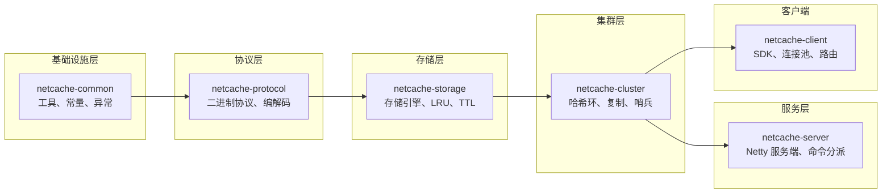

# NetCache 新人入职指南

> 👶 新人入职请先读 ONBOARDING.md

---

## 灵魂三问

### ① NetCache 是什么？

NetCache 是一个**轻量级分布式 KV 缓存引擎**，基于 Java 17 + Netty 4 实现。它支持 Redis 核心命令子集（GET/SET/DEL/EXPIRE/INCR 等），提供一致性哈希分片、主从异步复制、Sentinel 哨兵故障转移。

**一句话类比**：NetCache = Redis 的功能 + Java 的工程化 + 可学习的架构实现。

---

### ② 我从哪开始读？

**第一天**：读完这套文档（按顺序）

```
阅读顺序：
1. 00-README.md（本文件）  ← 你在这里
2. 01-architecture-overview.md  ← 全局视图
3. 02-module-common.md  ← 基础工具
4. 03-module-protocol.md  ← 网络协议
5. 04-module-storage.md  ← 数据存储
6. 05-module-cluster.md  ← 一致性哈希
7. 06-module-replication.md  ← 主从复制
8. 07-module-sentinel.md  ← 故障转移
9. 08-module-server.md  ← Netty 服务端
10. 09-module-client.md  ← 客户端 SDK
11. 10-end-to-end-trace.md  ← 完整请求追踪
12. 11-failover-walkthrough.md  ← 故障演练
13. 12-debug-and-tools.md  ← 调试工具
14. 13-faq.md  ← 常见问题
15. 14-contribute.md  ← 如何贡献代码
```

**第二天**：跑通 quickstart

```bash
mvn clean verify
docker compose up --build
# 用 SampleClient 测试 SET/GET
```

**第三天**：改一个简单 bug

从 [13-FAQ](./13-faq.md) 中挑一个「动手练习」，尝试修改代码。

---

### ③ 第一周该做什么？

| 时间 | 任务 | 目标 |
|---|---|---|
| Day 1 | 读完 01~09，理解架构 | 能画架构图 |
| Day 2 | 跑通 quickstart | 能用 SampleClient |
| Day 3 | 改一个简单 bug | 提交第一个 PR |
| Day 4-5 | 深入理解一个模块 | 能向他人解释 |
| Week 2 | 开始真正参与开发 | 完成第一个任务 |

---

## 知识图谱



---

## 核心概念速查

| 概念 | 文档 | 一句话解释 |
|---|---|---|
| 一致性哈希 | [05-module-cluster.md](./05-module-cluster.md) | 把数据分布在 0~2^64 环上，加减节点只影响邻居 |
| 分段 LRU | [04-module-storage.md](./04-module-storage.md) | 16 段双向链表，降低锁竞争 |
| 时间轮 TTL | [04-module-storage.md](./04-module-storage.md) | 每 100ms 扫描一次过期 key |
| 主从复制 | [06-module-replication.md](./06-module-replication.md) | master 写命令推给 slave，slave 断点续传 |
| SDOWN/ODOWN | [07-module-sentinel.md](./07-module-sentinel.md) | 单哨兵下线判定 / 多哨兵达成共识 |
| Raft 选举 | [07-module-sentinel.md](./07-module-sentinel.md) | 简化版 leader 选举用于 failover 协调 |

---

## 快速定位

| 问题类型 | 找哪个文档 |
|---|---|
| 不知道 NetCache 是什么 | [01-architecture-overview.md](./01-architecture-overview.md) |
| 想看某个模块的设计 | 按编号找对应模块文档 |
| SET 请求是怎么工作的？ | [10-end-to-end-trace.md](./10-end-to-end-trace.md) |
| master 挂了会发生什么？ | [11-failover-walkthrough.md](./11-failover-walkthrough.md) |
| 想知道某个类怎么用 | 看对应模块的「代码导读」章节 |
| 遇到报错不知道怎么排查 | [12-debug-and-tools.md](./12-debug-and-tools.md) |
| 有常见问题 FAQ | [13-faq.md](./13-faq.md) |
| 想贡献代码 | [14-contribute.md](./14-contribute.md) |

---

## 常见文件位置

| 文件 | 路径 |
|---|---|
| 架构文档 | `NetCache-Architecture.md` |
| 协议文档 | `docs/protocol.md` |
| 部署文档 | `docs/deploy.md` |
| 故障转移文档 | `docs/failover.md` |
| 快速入门 | `docker-compose.yml` |
| 客户端示例 | `netcache-client/src/main/java/com/netcache/client/SampleClient.java` |

---

## 下一步

直接进入 [01-architecture-overview.md](./01-architecture-overview.md)，从全局视角理解 NetCache。
