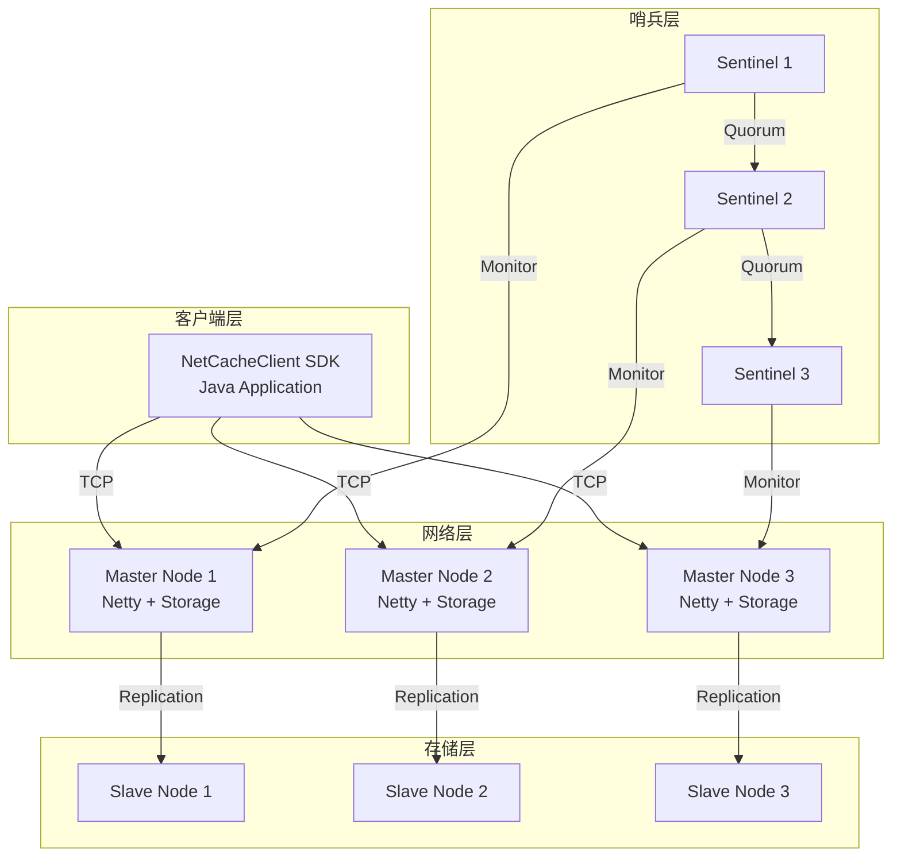
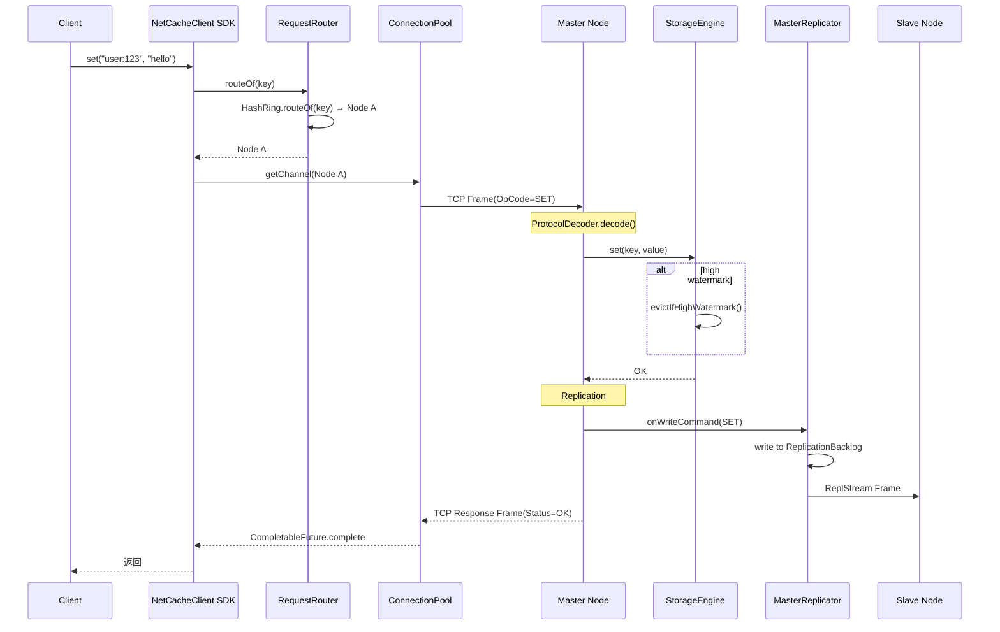
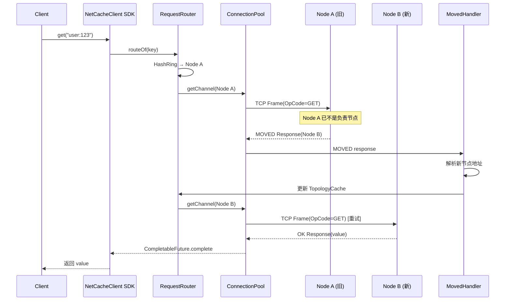
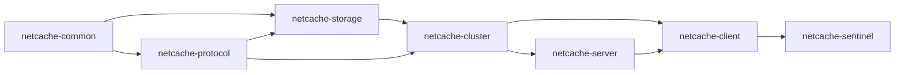

# 01 - NetCache 架构总览

## TL;DR

NetCache 是一个轻量级分布式 KV 缓存系统，用 Java 17 + Netty 4 实现。它通过一致性哈希做分片、主从异步复制保证数据安全、Sentinel 哨兵实现故障转移，对外提供 Java 客户端 SDK。理解它需要三张图：架构图、分片路由图、请求流程图。

---

## 它解决什么问题

需要一个能水平扩展的缓存层，存放热点数据，减少数据库压力。但不能太复杂——能快速上手、容易调试、主要用来学习分布式系统的核心概念。

**场景化**：想象公司茶水间的「快递柜」——每个员工分配一个柜子（哈希分片），重要文件在主柜和副柜各存一份（主从复制），后勤阿姨（哨兵）监控柜子状态，坏了就换新的。

---

## 核心概念（7个）

### 节点（Node）

**概念**：NetCache 集群中的一个服务器进程。

**两种角色**：
- **Master（主节点）**：处理读写请求
- **Slave（从节点）**：只读，或接收主节点的复制流

**💡 类比**：快递柜的主柜和副柜——主柜能收件，副柜只能取件。

---

### 一致性哈希（Consistent Hashing）

**概念**：把数据映射到 0~2^64 的环上，每个节点负责一段区间。

**💡 类比**：快递公司的「分拣中心」——不是按地区分，而是按「哈希值」分。加减节点只影响相邻区段。

**为什么用虚拟节点？**
一个物理节点映射 160 个虚拟节点，让数据分布更均匀，避免「热点节点」。

---

### 存储引擎（Storage Engine）

**概念**：内存中的 `ConcurrentHashMap`，配合分段 LRU 和时间轮 TTL。

**💡 类比**：档案室的「智能档案柜」——按访问频率自动把常用文件放前面，久的文件放后面或销毁。

**关键设计**：
- 数据存在 `ConcurrentHashMap<ByteKey, StoredValue>`
- LRU 用 16 段双向链表，降低锁竞争
- TTL 用时间轮后台扫描，每 100ms tick 一次

---

### 主从复制（Replication）

**概念**：master 写入的数据通过复制流推送给 slave，保持最终一致。

**💡 类比**：电视台「录像带备份」——主电视台录节目，给从电视台寄录像带。

**关键点**：
- 异步复制，不阻塞主写入
- `ReplicationBacklog`（16MB 环形缓冲区）存储最近的写命令
- slave 断开重连后可以断点续传（PSYNC 协议）

---

### 哨兵（Sentinel）

**概念**：独立进程监控节点状态，触发故障转移。

**💡 类比**：医院的「值班医生」——监控所有科室，发现问题自动协调「选举新主任」。

**Failover 流程**：
1. **SDOWN（主观下线）**：单个哨兵检测到 master 无响应
2. **ODOWN（客观下线）**：多个哨兵（≥quorum）确认 master 挂了
3. **Raft 选举**：哨兵们选出一个 leader 协调 failover
4. **提升 slave**：leader 选最优的 slave 提拔为新 master
5. **广播新拓扑**：通知所有客户端刷新路由

---

### 客户端 SDK（Client SDK）

**概念**：Java 程序连接 NetCache 集群的 SDK，提供同步和异步 API。

**💡 类比**：快递柜的「自助寄件机」界面——把包裹放进去、拿到取件码，不用知道内部怎么分拣。

**关键组件**：
- `ConnectionPool`：每节点 8 条长连接，Round-Robin
- `TopologyCache`：本地缓存的哈希环
- `RequestRouter`：根据 key 路由到目标节点
- `RetryPolicy`：指数退避 + jitter 重试

---

### 协议（Protocol）

**概念**：客户端和服务器通信的二进制格式。

**帧头布局（18 字节）**：

```
  0        4         5      6           14        18           N
  +--------+---------+------+-----------+--------+--------------+
  | Magic  | Version | Type | RequestId | Length |   Payload    |
  | 4B     | 1B      | 1B   | 8B        | 4B     |   N B        |
  +--------+---------+------+-----------+--------+--------------+
```

---

## 架构图

### 系统架构



### 数据分片架构

```mermaid
graph LR
    subgraph Client
        Key[客户端请求<br/>key: "user:123"]
    end

    subgraph Router
        Key -->|路由| Router[RequestRouter<br/>一致性哈希]
        Router -->|查询| Ring[HashRing<br/>160 vnodes/物理节点]
    end

    subgraph Cluster
        Ring -->|节点A| NodeA[Node A<br/>10.0.0.1:7001]
        Ring -->|节点B| NodeB[Node B<br/>10.0.0.2:7001]
        Ring -->|节点C| NodeC[Node C<br/>10.0.0.3:7001]
    end

    subgraph Storage
        NodeA -->|StorageEngine| MapA[ConcurrentHashMap]
        NodeB -->|StorageEngine| MapB[ConcurrentHashMap]
        NodeC -->|StorageEngine| MapC[ConcurrentHashMap]
    end
```

---

## 完整请求流程

### SET 请求流程



### GET 请求流程（考虑 MOVED）



---

## 关键设计决策

### 为什么用一致性哈希？

**方案 A**：普通哈希 `hash(key) % nodeCount`
- 问题：节点数量变化时，所有数据都要重新分布（缓存雪崩）

**方案 B**：一致性哈希 + 虚拟节点
- 优点：加/减节点只影响相邻区段，数据迁移量小
- 缺点：实现复杂一点

NetCache 选择方案 B，用 160 个虚拟节点/物理节点保证负载均衡。

---

### 为什么用异步复制？

同步复制（等 slave 接收到数据才返回）会显著增加延迟。NetCache 的目标是「高性能」，所以用异步复制——master 写完就返回，slave 稍后收到。

代价是「故障时可能丢失少量数据」，但对缓存场景可接受。

---

### 为什么用 Sentinel 而不是 Raft？

Sentinel 是一个「轻量级协调方案」：
- 故障检测 + 投票 + leader 选举
- 不做日志复制（master 的数据在 ReplicationBacklog 里）

完整 Raft 用于共识系统（如 etcd），实现更复杂。Sentinel 对缓存场景足够。

---

## 模块依赖关系



---

## 下一步

- 理解了全局架构，下一步深入 [02-module-common.md](./02-module-common.md)，了解核心工具类。
