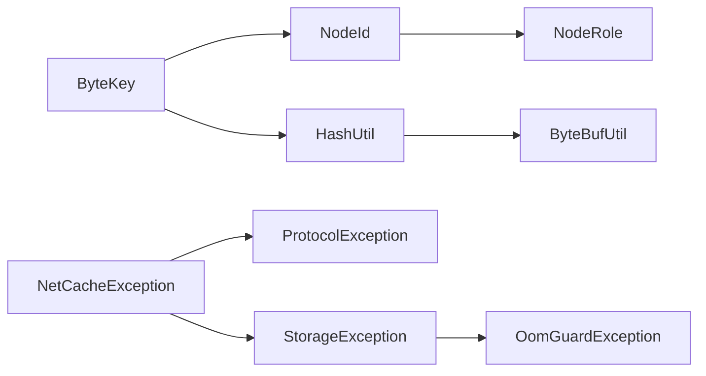

# 02 - netcache-common 模块导览

## TL;DR

`netcache-common` 是 NetCache 的「地基」模块——所有其他模块都依赖它，却不反向依赖任何模块。它提供三样东西：**节点身份**（`NodeId`、`NodeRole`）、**缓存键**（`ByteKey`）、以及**工具箱**（`HashUtil`、`ByteBufUtil`、异常体系）。

---

## 它解决什么问题

分布式缓存面临一个根本问题：谁来标识节点？谁来作为键？这些「身份」问题不能依赖于业务层，否则每个模块都要自己定义。

**场景化**：想象你要给公司的快递柜编号——`ByteKey` 就是「格口号」（不可伪造、不可变的格口编号），`NodeId` 就是「柜子序列号」（全局唯一），而 `NodeRole` 只是「这格口是主柜还是副柜」。

---

## 核心概念（5个）

### ByteKey —— 不可变缓存键

**概念**：包装 `byte[]` 的不可变键类型。

**类比**：就像快递柜的格口号——一旦确定就固定了，别人改了格口里的东西不会改变格口号本身。

**为什么需要它**：`byte[]` 在 Java 中是可变对象，直接用作 HashMap 的 key 有风险（外部修改后 hash 变化）。`ByteKey` 通过防御性拷贝和缓存 hash 值解决这个问题。

```java
// 用法示例
ByteKey key = new ByteKey("user:123".getBytes());
byte[] data = key.bytes();  // 返回克隆，不暴露内部数组
```

**关键实现**：
- 构造时 `clone()` 防御性拷贝——外部改不了内部
- 缓存 `hash` 值——避免每次 `hashCode()` 重新计算
- `compareTo` 用无符号比较——和 Redis 的行为一致

---

### NodeId —— 节点身份证

**概念**：基于 UUID 的节点唯一标识符。

**类比**：快递柜的机身序列号，出厂就定好了，全球唯一。

**为什么需要它**：集群中每个节点需要一个稳定的标识，不依赖于 IP（IP 会变），用 UUID 保证唯一性。

```java
// 用法示例
NodeId id = NodeId.random();          // 新建随机 ID
NodeId id = NodeId.fromString(str);    // 从字符串恢复
```

**关键实现**：
- `record` 不可变，线程安全
- 基于 `java.util.UUID`

---

### NodeRole —— 节点角色枚举

**概念**：只有两个值——`MASTER` 和 `SLAVE`。

**类比**：主柜/副柜——主柜能收件、从柜只能转发。

```java
if (role == NodeRole.MASTER) {
    // 能处理写入
} else {
    // 只读或转发
}
```

---

### HashUtil —— MurmurHash3 哈希工具

**概念**：高性能 64 位哈希函数，用于一致性哈希路由。

**类比**：快递公司的「自动分拣机」——输入格口号，输出一个路由编号。

**为什么需要它**：一致性哈希需要把键映射到 0~2^64 的环上，MurmurHash3 分布均匀、计算快。

```java
long hash = HashUtil.hash64(keyBytes);
// 结果用于 HashRing.routeOf()
```

**关键实现**：
- 实现 MurmurHash3_x64_128，取低 64 位
- `C1 = 0x87c37b91114253d5L`、`C2 = 0x4cf5ad432745937fL` 是标准幻数
- `fmix64` 是最终混合函数，消除初始偏差

---

### ByteBufUtil —— Netty ByteBuf 好帮手

**概念**：简化 Netty ByteBuf 操作的工具类。

**类比**：快递柜的操作面板——帮你安全地「切一块」或「检查是否够用」。

**为什么需要它**：Netty 的 ByteBuf 引用计数稍有不慎就泄漏或重复释放，这个工具类把常见操作封装安全。

```java
// 常见用法
ByteBuf slice = ByteBufUtil.readRetainedSlice(buf, 10);  // 读 10 字节并保留引用
ByteBufUtil.release(buf);                                 // 安全释放
ByteBufUtil.assertEqual(expected, actual);                // 测试用：比较两个 buf
```

**关键实现**：
- `readRetainedSlice` vs `retainedSlice`：前者移动读指针，后者不移动
- `requireReadable` 检查是否有足够可读字节
- `release` 是 `ReferenceCountUtil.release()` 的别名

---

## 关键流程

### ByteKey 构造流程

```text
外部 byte[] → 防御性 clone → 存入内部 bytes[] → 计算并缓存 hash
```

### HashUtil 计算流程

```text
输入 bytes[0..n-1]
  ↓
每 16 字节分块：k1 *= C1, rotate31, *= C2 → h1
              k2 *= C2, rotate33, *= C1 → h2
  ↓
处理尾部 0..15 字节（switch）
  ↓
h1 ^= len; h2 ^= len; 混合
  ↓
fmix64(h1); fmix64(h2)
  ↓
返回 h1（低 64 位）
```

---

## 代码导读

### 1. ByteKey.java —— 缓存键的防御性设计

**文件**：`netcache-common/src/main/java/com/netcache/common/ByteKey.java`

**关键点**：
- 行 13-16：构造函数做防御性拷贝 `clone()`
- 行 15：缓存 hash 值避免重复计算
- 行 41：`compareTo` 用 `Arrays.compareUnsigned` 做无符号字节比较

```java
// 行 13-16：防御性拷贝演示
public ByteKey(byte[] bytes) {
    this.bytes = Objects.requireNonNull(bytes, "bytes").clone();  // 克隆一份
    this.hash = Arrays.hashCode(this.bytes);                        // 缓存 hash
}
```

### 2. HashUtil.java —— MurmurHash3 位运算迷宫

**文件**：`netcache-common/src/main/java/com/netcache/common/util/HashUtil.java`

**关键点**：
- 行 6-7：C1、C2 幻数是 MurmurHash3 标准值
- 行 25-48：主循环处理 16 字节块
- 行 50-94：尾部处理（不足 16 字节）
- 行 106-124：`getLongLittleEndian` 小端读取 + `fmix64` 最终混合

### 3. ByteBufUtil.java —— Netty 引用计数安全工具

**文件**：`netcache-common/src/main/java/com/netcache/common/util/ByteBufUtil.java`

**关键点**：
- 行 12-14：`readRetainedSlice` 移动读指针并保留引用
- 行 17-22：`retainedSlice` 不移动读指针
- 行 42-59：`assertEqual` 逐字节比较两个 ByteBuf

---

## 常见坑

### 1. ByteKey 的 `bytes()` 返回克隆而非原数组

```java
ByteKey key = new ByteKey(new byte[]{1, 2, 3});
byte[] arr = key.bytes();
arr[0] = 99;  // 安全！不会影响 key 内部状态
```

但如果你需要修改数组内容，不要用这个克隆——每次调用都创建新数组，性能敏感代码注意。

### 2. 无符号比较在小端序机器上的坑

`Arrays.compareUnsigned` 在 Java 9+ 才有。如果看到 `compareTo` 返回负数，可能是正常的（字节字典序比较）。

### 3. HashUtil.hash64 输入为 null 会抛异常

```java
HashUtil.hash64(null);  // NullPointerException
```

如果键可能为 null，外部要先判空。

### 4. ByteBuf 必须及时 release

`ByteBufUtil.release()` 或 `ReferenceCountUtil.release()` 是必须的，否则 Netty 池化内存会泄漏。

### 5. MurmurHash3 结果不等于 Java 的 hashCode

不要把 `HashUtil.hash64()` 的结果当成 `ByteKey.hashCode()`——它们是不同的哈希算法。

---

## 动手练习

### 练习 1：验证 ByteKey 的防御性拷贝

```java
byte[] original = new byte[]{1, 2, 3};
ByteKey key = new ByteKey(original);
original[0] = 99;  // 修改原数组

byte[] fromKey = key.bytes();
System.out.println(fromKey[0]);  // 期望输出 1，不是 99
```

### 练习 2：观察无符号比较的行为

```java
ByteKey a = new ByteKey(new byte[]{(byte) 0xFF});
ByteKey b = new ByteKey(new byte[]{0x01});
System.out.println(a.compareTo(b));  // 正数，因为 0xFF > 0x01
```

### 练习 3：测试 HashUtil 的分布均匀性

生成 10 万个随机键的哈希值，统计低位 4 位的分布——应该接近均匀的 16/16。

---

## 模块内部依赖图



---

## 下一步

- 学会了「节点身份」和「键」的表示，下一步进入 [03-模块协议层](./03-module-protocol.md)，看看这些键怎么在网络上传输。
