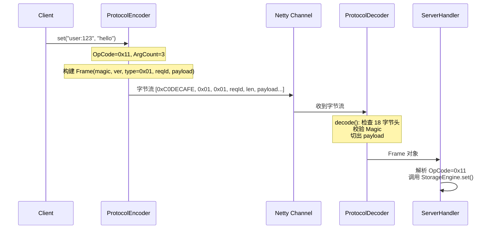

# 03 - netcache-protocol 模块导览

## TL;DR

`netcache-protocol` 是 NetCache 的「普通话」——所有节点之间的通信都靠它。它定义了 18 字节的帧头、请求/响应的编码格式、以及各种操作码（OpCode）。理解这个模块，就理解了 NetCache 在网络上传输的每一个 bit 的含义。

---

## 它解决什么问题

当客户端对服务器说「帮我存一下 user:123=world」时，这句话必须变成一串字节在网络上飞。这些字节怎么排布、每段代表什么、对方怎么解析——这就是协议层要解决的问题。

**场景化**：就像寄快递要填运单——收件人地址、物品描述、签名栏各有格式。NetCache 的协议就是这套「运单格式」，只不过是人读不懂的二进制。

---

## 核心概念（7个）

### Frame —— 协议帧

**概念**：所有网络通信的基本单位。一个 Frame 由固定的 18 字节头 + 变长 Payload 组成。

**💡 类比**：就像一封信——信封上的邮编、收件人邮编（18字节头）、信纸内容（Payload）。

**帧头布局（共 18 字节）：**

```
  0        4         5      6           14        18           N
  +--------+---------+------+-----------+--------+--------------+
  | Magic  | Version | Type | RequestId | Length |   Payload    |
  | 4B     | 1B      | 1B   | 8B        | 4B     |   N B        |
  +--------+---------+------+-----------+--------+--------------+
```

- **Magic (4B)**：`0xC0DECAFE`——收到帧先检查这 4 字节，不对就关连接
- **Version (1B)**：协议版本，当前 `0x01`
- **Type (1B)**：`0x01`=请求, `0x02`=响应, `0x03`=复制流, `0x04`=哨兵心跳
- **RequestId (8B)**：客户端单调递增，用于匹配请求和响应
- **Length (4B)**：Payload 长度（不含头），最大 16MB
- **Payload (NB)**：请求体或响应体

---

### OpCode —— 操作码

**概念**：命令的唯一标识符，一个字节。

**💡 类比**：快递的「业务类型」栏——文件签收、特快专递、国际件，各有编号。

**主要操作码：**

| 值 | 命令 | 说明 | 参数 |
|---|---|---|---|
| 0x10 | GET | 读取 | key |
| 0x11 | SET | 写入 | key, value, [ttlMs] |
| 0x12 | DEL | 删除 | key |
| 0x13 | EXPIRE | 设置过期 | key, ttlMs |
| 0x14 | TTL | 查询剩余 TTL | key |
| 0x15 | EXISTS | 是否存在 | key |
| 0x16 | INCR | 原子自增 | key |
| 0x17 | DECR | 原子自减 | key |
| 0x20 | PING | 心跳 | - |
| 0x21 | INFO | 节点信息 | section |
| 0x30 | CLUSTER_NODES | 拓扑查询 | - |
| 0x40 | SLAVEOF | 设为主从 | host, port |
| 0x41 | PSYNC | 复制握手 | replId, offset |
| 0x50 | SENTINEL_HELLO | 哨兵互发现 | - |
| 0x51 | SENTINEL_FAILOVER | 触发选主 | masterName |

---

### Request —— 请求负载

**概念**：请求类型的帧携带的载荷结构。

**请求 Payload 布局：**

```
+--------+--------------+----------+----------+----+----------+
| OpCode | ArgCount(2B) | Arg1Len  | Arg1Body | ...| ArgNBody |
| 1B     | 2B           | 4B       | M B      |    |          |
+--------+--------------+----------+----------+----+----------+
```

- **OpCode (1B)**：命令类型
- **ArgCount (2B)**：参数个数（无符号短整型）
- **Arguments**：每个参数由 4 字节长度 + N 字节内容组成

**示例**：SET 命令 `SET user:123 "hello" 3600000` 编码为：

```
0x11          -- OpCode = SET
03 00         -- ArgCount = 3
08 00 00 00   -- Arg1Len = 8 ("user:123")
75 73 65 ... -- Arg1Body = "user:123"
05 00 00 00   -- Arg2Len = 5 ("hello")
68 65 6c ... -- Arg2Body = "hello"
00 4E 20 00   -- Arg3Len = 3600000 (毫秒 TTL)
```

---

### Response —— 响应负载

**概念**：响应类型的帧携带的载荷结构。

**响应 Payload 布局：**

```
+--------+-------------+----------+
| Status | ResultType  |  Body    |
| 1B     | 1B          |  varies |
+--------+-------------+----------+
```

- **Status (1B)**：`0x00`=OK, `0x01`=ERROR, `0x02`=MOVED（重定向）, `0x03`=ASK, `0x04`=NIL（空）
- **ResultType (1B)**：`0x00`=NULL, `0x01`=STRING, `0x02`=INT64, `0x03`=BYTES, `0x04`=NODE_LIST, `0x05`=ERROR_MSG
- **Body**：根据 ResultType 而定的实际数据

**MOVED 响应体**（当 Status=0x02 时）：
```
NodeId(16B) + host(varStr) + port(2B)
```

---

### ProtocolDecoder —— 帧解码器

**概念**：Netty 的 `ByteToMessageDecoder`，把字节流组装成 `Frame` 对象。

**💡 类比**：快递网点的「拆包员」——把运单封袋拆开，按格式检查内容。

**关键流程：**

1. 检查可读字节是否够 18 字节头，不够就返回（半包）
2. 读取 Magic 校验，失败则关连接
3. 读取 RequestId、Length
4. 检查 Payload 是否完整，不完整则 resetReaderIndex（粘包处理）
5. 用 `readRetainedSlice` 切出 Payload（保留引用）

```java
// 行 618 附近的关键代码
ByteBuf payload = in.readRetainedSlice(len);  // 切出 payload，保留引用
out.add(new Frame(magic, version, type, reqId, payload));
```

**为什么要用 `readRetainedSlice`？**
因为下游 handler 可能会跨 EventLoop 异步处理这个 ByteBuf，原始 ByteBuf 此时可能已被释放。所以要切一片 retainedSlice，引用计数 +1。

---

### ProtocolEncoder —— 帧编码器

**概念**：Netty 的 `MessageToByteEncoder`，把 `Frame` 对象序列化成字节流。

**关键流程：**

1. 写入 Magic (4B)
2. 写入 Version (1B)
3. 写入 Type (1B)
4. 写入 RequestId (8B)
5. 写入 Length (4B)
6. 写入 Payload

---

### MagicValidator —— 帧校验器

**概念**：一个 `MessageToMessageDecoder`，在 `LengthFieldBasedFrameDecoder` 之后检查 Magic。

**为什么单独一个 handler？**
- `LengthFieldBasedFrameDecoder` 只管长度，不管内容对不对
- 收到非法帧（比如只写了半截）就直接关连接，避免处理坏数据

**关键行为：**
- 检查 Magic 是否为 `0xC0DECAFE`
- 不是就关连接并抛异常

---

## 关键流程

### 客户端发送 SET 命令的完整编码流程



### 帧的粘包/半包处理

```
情况1：粘包（两个帧粘在一起）
[Frame1: 18B header + N1 B payload][Frame2: 18B header + N2 B payload]
                                            ↑ readRetainedSlice 只取 Frame1 的 payload

情况2：半包（Frame1 的 payload 还没收完）
[Frame1: 18B header + N1 B payload]（N1 > 0 but in.readableBytes() < N1）
                                    → resetReaderIndex，等待更多数据
```

---

## 代码导读

### 1. Frame.java —— 帧定义

**文件**：`netcache-protocol/src/main/java/com/netcache/protocol/Frame.java`

**关键点**：
- 行 11：`HEADER_LENGTH = 18`——固定的帧头长度
- record 不可变，线程安全

```java
/**
 * 协议帧 —— 网络通信的基本单位。
 * <p>
 * 想象一封信：信封上的邮编、收件人信息就是帧头（18 字节），信纸内容就是 Payload。
 * <p>
 * 帧头布局（共 18B 头 + N B payload）：
 * <pre>
 *   +-------+-----+----+-----------+--------+----------+
 *   | Magic | Ver | T  | RequestId | Length | Payload  |
 *   |  4B   | 1B  | 1B |    8B     |   4B   |   N B    |
 *   +-------+-----+----+-----------+--------+----------+
 * </pre>
 */
public record Frame(int magic, byte version, byte type, long reqId, ByteBuf payload) {
```

### 2. ProtocolDecoder.java —— 半包处理的关键

**文件**：`netcache-protocol/src/main/java/com/netcache/protocol/codec/ProtocolDecoder.java`

**关键点**：
- 行 618：`readRetainedSlice` 保留引用交给下游
- `markReaderIndex/resetReaderIndex` 模式处理半包

### 3. Request.java —— 请求编解码

**文件**：`netcache-protocol/src/main/java/com/netcache/protocol/command/Request.java`

**关键点**：
- `record` 不可变
- 包含 `ByteBuf payload`——不克隆，保持零拷贝

### 4. OpCode.java & Status.java —— 枚举定义

**文件**：`netcache-protocol/src/main/java/com/netcache/protocol/OpCode.java` 和 `Status.java`

**关键点**：
- OpCode 用十六进制便于对照协议文档
- 所有操作码按功能分组（存储、系统、集群、哨兵）

---

## 常见坑

### 1. 忘记检查 Payload 长度就读取

```java
// 错误：readableBytes 可能小于声明的 length
int len = in.readInt();
ByteBuf payload = in.readBytes(len);  // 可能读不到足够数据

// 正确：先检查，不够就等
if (in.readableBytes() < len) {
    in.resetReaderIndex();
    return;
}
```

### 2. ByteBuf 引用泄漏

`readBytes` 会消费字节但释放底层内存，而 `readRetainedSlice` 保留引用。如果下游异步处理，用错了就会「use after release」。

### 3. RequestId 不匹配

客户端并发请求时，如果 RequestId 重复或乱序，响应会匹配到错误的请求。NetCache 用 `AtomicLong` 单调递增生成 RequestId。

### 4. MOVED 响应的 Body 格式混淆

Status=0x02 (MOVED) 时的 Body 不是普通 ResultType，而是 `nodeId(16B) + host(varStr) + port(2B)`。客户端收到 MOVED 后要解析这个格式。

### 5. 协议版本不兼容

当前版本 `0x01`。如果未来升级到 `0x02`，`MagicValidator` 会因为版本不匹配关连接。这是好事——避免处理未知版本的协议。

---

## 动手练习

### 练习 1：手动编解码一个 GET 请求

用 ByteBuf 手动构建：
```java
ByteBuf buf = Unpooled.buffer();
buf.writeInt(0xC0DECAFE);      // Magic
buf.writeByte(0x01);           // Version
buf.writeByte(0x01);          // Type = 请求
buf.writeLong(1L);            // RequestId = 1
buf.writeInt(9);              // Length = 9 (1 byte OpCode + 2 byte ArgCount + 6 bytes for "user:123")
buf.writeByte(0x10);           // OpCode = GET
buf.writeShort(1);           // ArgCount = 1
buf.writeInt(8);             // Arg1Len = 8
buf.writeBytes("user:123".getBytes());
```

验证：用 `ProtocolDecoder` 解码能得到同样的请求。

### 练习 2：模拟半包场景

构造一个只包含 18 字节头 + 2 字节 payload 的 ByteBuf（但声明的 Length=10），验证 `ProtocolDecoder` 会等待而非报错。

### 练习 3：解析 MOVED 响应

构建一个 Status=0x02 的响应，解析出目标节点地址。

---

## 下一步

- 理解了「普通话」，下一步看 [04-存储引擎](./04-module-storage.md)，看看数据到底存在哪儿、怎么淘汰。
