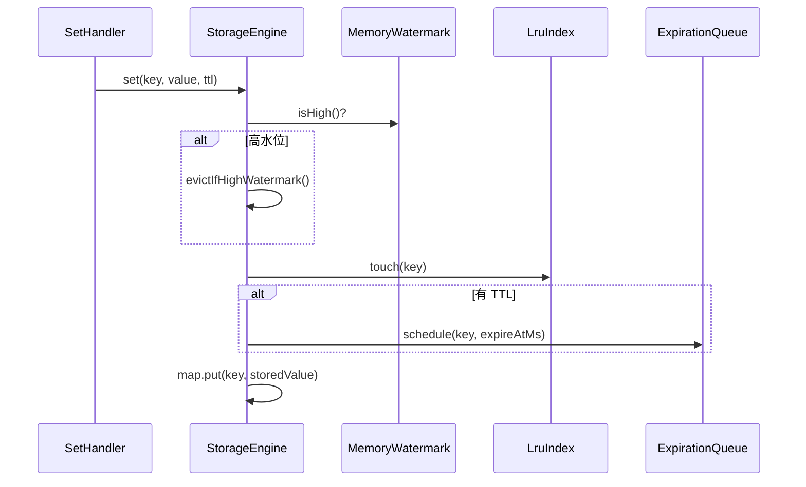

# 04 - netcache-storage 模块导览

## TL;DR

`netcache-storage` 是 NetCache 的「档案柜」——所有数据最终都存在这里。它用 `ConcurrentHashMap` 做实际存储，用「分段 LRU」做淘汰策略，用「时间轮」做 TTL 管理，用「双水位线」做内存保护。理解这个模块，就理解了 NetCache 的数据存储机制。

---

## 它解决什么问题

缓存系统面临一个核心矛盾：**内存不是无限的**。当数据越来越多，总会触达内存上限。这时候就要决定——淘汰谁？保留谁？

**场景化**：想象你是档案室管理员，柜子只能放 1000 份文件。当档案满了，你得决定把哪些旧档案销毁、哪些保留以便快速查阅。这就是存储引擎做的事情。

---

## 核心概念（7个）

### StorageEngine —— 存储引擎主入口

**概念**：协调 `ConcurrentHashMap`、`LruIndex`、`ExpirationQueue`、`MemoryWatermark` 的核心引擎。

**💡 类比**：档案室管理员——不是自己存文件，而是协调管理员团队。

**协作关系：**
- 调用 `LruIndex.touch()` 记录访问顺序
- 调用 `ExpirationQueue.schedule()` 安排过期检查
- 调用 `MemoryWatermark.isHigh()` 检查是否需要淘汰
- 调用 `EvictionPolicy.evictOne()` 执行淘汰

**关键方法：**

| 方法 | 作用 | 返回值 |
|---|---|---|
| `get(key)` | 读取并检查过期 | value 或 null |
| `set(key, value, ttl)` | 写入，触发淘汰检查 | void |
| `incr(key)` | 原子自增 | 新的计数值 |
| `expire(key, duration)` | 设置过期时间 | 是否成功 |

**懒过期**：GET 时才检查 `isExpired()`，已过期则删除并返回 null。

---

### StoredValue —— 存储值的抽象

**概念**：`sealed interface`，只有两个实现：`StringValue`（字节数组）和 `CounterValue`（64 位整数）。

**💡 类比**：档案的两种格式——文字档案（StringValue）和数字档案（CounterValue）。

```java
public sealed interface StoredValue permits StringValue, CounterValue {
    long expireAtMs();      // 0 表示无过期
    long lastAccessMs();    // LRU 用
    int sizeBytes();        // 占用空间
}
```

---

### StringValue —— 字节数组值

**概念**：标准的 KV 存储，包装 `byte[]`。

**特点**：
- 构造时克隆输入，输出时也克隆——防御性拷贝
- `sizeBytes()` = `8 + bytes.length`（头部长度 + 数据）

```java
StringValue sv = new StringValue(data, expireAtMs, lastAccessMs);
byte[] out = sv.bytes();  // 克隆，不暴露内部数组
```

---

### CounterValue —— 原子计数器值

**概念**：用于 `INCR`/`DECR` 的 64 位整数包装。

**特点**：
- `add(delta)` 返回新的 `CounterValue`——不可变
- 溢出处理：超过 `Long.MAX_VALUE` 回到负数

```java
CounterValue cv = new CounterValue(100, 0, 0);
CounterValue next = cv.add(1);  // 返回新的 CounterValue(101, 0, 0)
```

---

### LruIndex —— 分段 LRU 索引

**概念**：16 段分段双向链表 + HashMap，降低锁竞争。

**💡 类比**：把档案室分成 16 个区，每个区有自己的管理员。访问文件时只在对应区加锁，其他区不受影响。

**为什么分段？**
- 不用全局锁——每段独立锁
- 16 是经验值：太少则竞争，太多则管理开销大

**关键字段：**
```java
private static final int SEGMENTS = 16;  // 经验值，太小负载不均，太大占内存
private final LruSegment[] segments;
private final AtomicInteger evictionCursor = new AtomicInteger(0);  // 轮询各段
```

---

### LruSegment —— 单段 LRU 实现

**概念**：单个 LRU 段，使用双向链表 + HashMap 实现。

**💡 类比**：一个区的档案管理——用链表按时间顺序排列，用 HashMap 快速查找。

**数据结构：**
```java
Map<ByteKey, Node> nodes;  // 快速查找
Node head, tail;          // 双向链表头尾（head 是最新访问）
```

**关键操作：**
- `touch(key)`：把节点移到链表头部
- `evictOne()`：从链表尾部移除最老的节点

---

### ExpirationQueue —— 时间轮 TTL 管理

**概念**：基于 Netty `HashedWheelTimer` 的后台 TTL 扫描器。

**💡 类比**：档案室的「到期提醒系统」——每过一段时间就翻看一下哪些档案该销毁了。

**工作流程：**
1. 每 100ms「tick」一次
2. 扫描一个槽位，检查该槽位上的 key 是否到期
3. 每次最多处理 200 个 key（避免阻塞时间轮线程）
4. 过期项进入「过期事件队列」，供复制层广播给从节点

**关键限制：**
```java
private static final int MAX_KEYS_PER_TICK = 200;  // 太多会 STW，太少 TTL 延迟
```

---

### MemoryWatermark —— 内存水位管理

**概念**：监控 JVM 堆使用率，触发淘汰或拒写。

**双水位机制：**

| 水位 | 阈值 | 行为 |
|---|---|---|
| 高水位 | 85% | 触发同步淘汰：每写入 1 次淘汰 1 个 |
| 危险水位 | 92% | 拒写：返回 `OomGuardException`，仅允许读和 DEL |

**💡 类比**：档案室的空间告警——85% 时开始清理过期档案，92% 时停止接收新档案。

---

## 关键流程

### SET 请求的处理流程



### LRU 淘汰流程

```text
evictIfHighWatermark() 被调用
  ↓
检查 MemoryWatermark.isHigh()
  ↓
是 → EvictionPolicy.evictOne()
  ↓
LruIndex.evictOne()
  ↓
evictionCursor % SEGMENTS 轮询到某段
  ↓
该段的 LruSegment.evictOne() → 得到最老的 ByteKey
  ↓
StorageEngine.map.remove(key)
```

### TTL 过期流程

```text
后台 HashedWheelTimer 每 100ms tick 一次
  ↓
ExpirationQueue.pollExpiredEvent()
  ↓
检查 entries 中到期的 key（expireAtMs <= nowMs）
  ↓
每 tick 最多处理 200 个
  ↓
对每个过期 key：map.remove(key) + 广播给从节点
```

---

## 代码导读

### 1. StorageEngine.java —— 存储引擎核心

**文件**：`netcache-storage/src/main/java/com/netcache/storage/StorageEngine.java`

**关键点**：
- 行 45：`map.compute()` 保证同 key 写的原子性
- 行 60：懒过期检查 `isExpired()`
- 行 68-75：高水位触发淘汰

```java
// 行 60：懒过期检查
if (v.isExpired(now)) {
    map.remove(k);
    return null;
}
```

### 2. LruIndex.java —— 分段 LRU

**文件**：`netcache-storage/src/main/java/com/netcache/storage/lru/LruIndex.java`

**关键点**：
- 行 16：`SEGMENTS = 16` 经验值
- 行 24：`evictionCursor` 轮询各段
- 行 35-43：`evictOne()` 各段轮询公平淘汰

### 3. LruSegment.java —— 双向链表实现

**文件**：`netcache-storage/src/main/java/com/netcache/storage/lru/LruSegment.java`

**关键点**：
- `touch()` 把节点移到 head
- `evictOne()` 从 tail 移除

### 4. ExpirationQueue.java —— 时间轮

**文件**：`netcache-storage/src/main/java/com/netcache/storage/ttl/ExpirationQueue.java`

**关键点**：
- 行 48：`MAX_KEYS_PER_TICK = 200` 限制
- `schedule()` 把任务加入队列，不是直接加入时间轮

---

## 常见坑

### 1. 并发写入同一个 key 不会死锁

`map.compute(k, (k, v) -> ...)` 是原子操作，但要注意 lambda 内的逻辑不要太复杂——它是在同步块里执行的。

### 2. TTL 精度有限

时间轮每 100ms tick，所以 TTL 有 ±100ms 的误差。这是可以接受的，因为缓存本来就不是精确到毫秒的。

### 3. 高水位淘汰可能不够快

每写入 1 次才淘汰 1 个，如果写入速度快，可能来不及淘汰就触发危险水位了。这种情况下 `OomGuardException` 会保护系统。

### 4. LRU 段数不可动态调整

`SEGMENTS = 16` 是编译时常量。如果在高并发下锁竞争严重，需要重启才能改这个值。

### 5. 防御性拷贝影响性能

每次 `set()` 和 `get()` 都 clone 字节数组。如果 value 很大且频繁操作，这里是热点。

---

## 动手练习

### 练习 1：观察 LRU 分段行为

写一个测试，顺序写入 10000 个 key，然后观察各段的分布是否均匀：

```java
LruIndex lruIndex = new LruIndex();
for (int i = 0; i < 10000; i++) {
    lruIndex.touch(new ByteKey(("key" + i).getBytes()));
}
// 打印各段的节点数，应该接近均匀分布
```

### 练习 2：测试高水位触发淘汰

设置 `highWatermark = 0.01`（极低），然后写入大量数据，观察淘汰是否及时触发。

### 练习 3：观察 TTL 误差

设置 TTL = 100ms，测量实际过期时间和设定时间的差距——应该在 ±100ms 以内。

---

## 下一步

- 理解了数据怎么存，下一步看 [05-集群管理](./05-module-cluster.md)，看看数据怎么分布在多个节点上。
