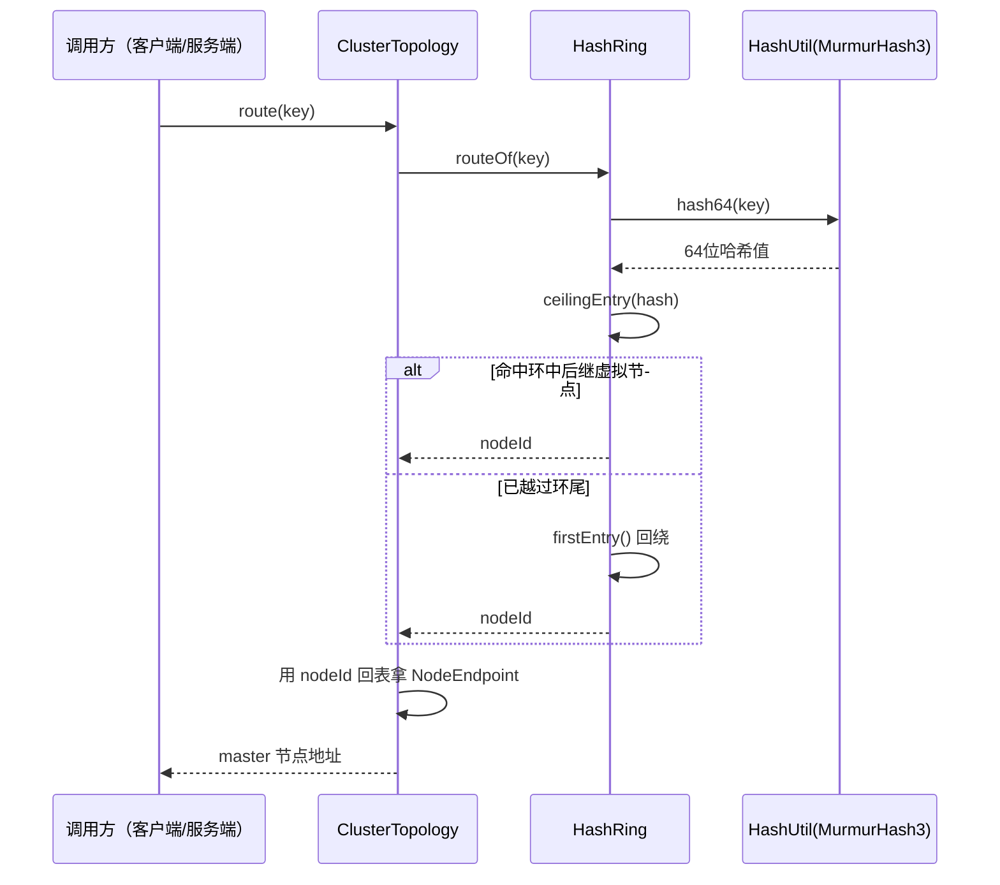
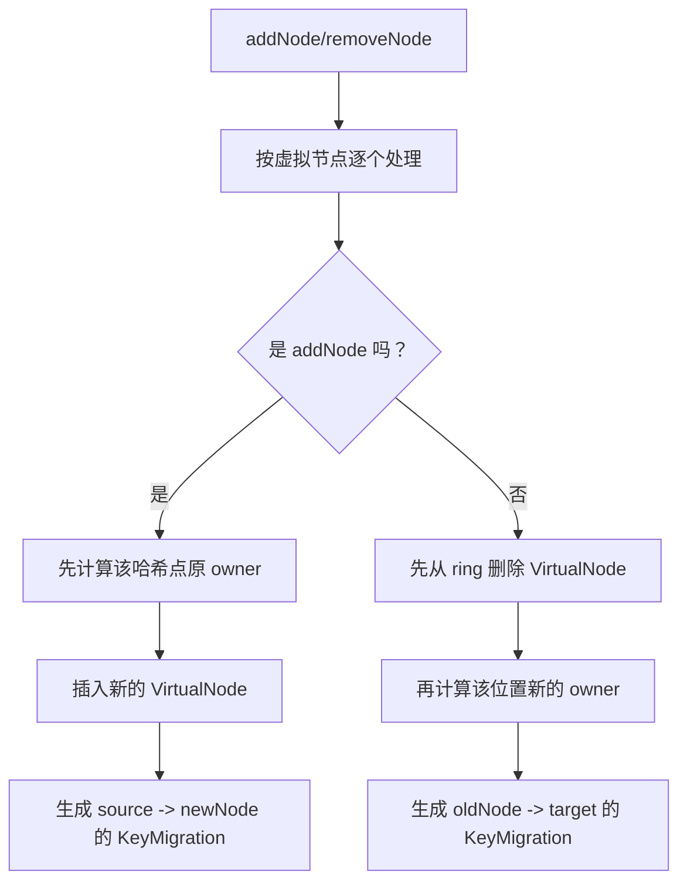

# 05 - netcache-cluster 模块导览

## TL;DR

`netcache-cluster` 是 NetCache 的「地图 + 分拣系统」：它一边维护当前集群里有哪些节点、谁是主谁是从，另一边把每个 key 稳定地路由到负责它的 master 节点。它用一致性哈希环减少扩缩容时的全量洗牌，用虚拟节点把数据分布摊平，再用 `epoch` 保证“新拓扑覆盖旧拓扑，旧消息直接作废”。如果你想搞清楚客户端为什么会把某个 key 发到某台机器，或者 Sentinel 切主后为什么大家不会继续打到旧主，这个模块就是答案。

---

## 它解决什么问题（场景化）

假设你在运营一个连锁仓库系统，全国有多台仓库机器，每台机器都保存一部分缓存数据。问题马上就来了：

1. 一个新的 key 写进来时，到底该放哪台机器？
2. 如果新加一台机器，难道所有 key 都要重新分配吗？
3. 如果某台 master 挂了，被提升出来的新 master 什么时候算“正式上任”？
4. 客户端、哨兵、服务端手里如果拿着不同版本的集群视图，请求会不会发错地方？

`netcache-cluster` 就是在解决这组问题。

**场景化理解**：把它想成一个大型物流园区：
- `HashRing` 像分拣转盘，包裹绕一圈后总能找到自己的出口。
- `VirtualNode` 像转盘上细分出来的很多小刻度，避免某个出口前面排满车、另一个出口却空着。
- `ClusterTopology` 像值班总控室的大屏地图，实时显示有哪些仓库节点、谁是主库、谁跟着谁。
- `epoch` 像地图版本号：你手里的地图如果比总控室旧，就不能再指挥车辆了。

没有这个模块时，最朴素的做法通常是“节点数取模”。它看起来简单，但节点一增一减，大多数 key 的归属都会变化，缓存命中率会骤降，迁移成本也会被放大。`netcache-cluster` 用一致性哈希把影响范围压缩到局部区段，再用拓扑版本控制把“谁说了算”这件事定清楚。

---

## 核心概念（6 个名词）

### HashRing —— 一致性哈希环

`HashRing` 是整个集群路由的核心。它内部使用 `TreeMap<Long, VirtualNode>` 维护一个按哈希值排序的环，key 先经过 MurmurHash3 计算出 64 位位置，再顺时针找到第一个虚拟节点，该虚拟节点所属的物理节点就是归属 master。

**💡 类比**：像一个圆形分拣转盘。每个包裹先被贴上一个数字标签，转盘顺时针第一个碰到的出口，就是它该去的仓库。

这里最关键的价值不是“能路由”，而是“节点变化时只改局部”。加减节点时，不是全网重新洗牌，而只是把相邻区段交接出去，所以扩容、缩容、故障切换时的抖动更小。

### VirtualNode —— 虚拟节点

`VirtualNode` 是一个很小但很重要的 `record`，只有 `nodeId`、`index`、`hash` 三个字段。物理节点数量通常不多，如果直接把几台物理机挂到环上，很容易出现某一段特别长、某一段特别短，导致数据倾斜。于是系统会给每个物理节点默认切出 160 个虚拟节点，把它们打散到环上。

**💡 类比**：不是给每家仓库只开一个收货口，而是给每家仓库开 160 个分散在转盘各处的小窗口。这样包裹更容易均匀分流，不会所有车都堵到同一个口子。

### ClusterTopology —— 集群拓扑

`ClusterTopology` 保存“当前版本下的全量节点视图”。里面不仅有 `NodeId -> NodeEndpoint` 的节点表，还持有一个只包含 master 节点的 `HashRing`，用于真正的 key 路由。它接收来自 Sentinel 推送或客户端拉取的拓扑快照，并用 `epoch` 决定是否应用这次更新。

**💡 类比**：像作战室里的电子地图。地图上不只写“有哪些点位”，还标清楚哪个点位是主据点、哪个点位是从属据点，调度系统必须以它为准。

### NodeEndpoint —— 节点名片

`NodeEndpoint` 记录的是节点的完整身份：`id`、`host`、`port`、`role`，以及当节点是 `SLAVE` 时它跟随的 `masterId`。`ClusterTopology` 并不是只关心“这个 key 去哪台 master”，它还要保留完整节点信息，方便客户端建连、哨兵广播和故障切换后重建视图。

**💡 类比**：像仓库员工胸牌，上面写着工号、办公地点、岗位，以及“这名员工归谁带”。没有这张名片，大家只能知道“有这个人”，却不知道该去哪里找他、他当前扮演什么角色。

### Epoch —— 拓扑版本号

`epoch` 是拓扑快照的单调递增版本号。`ClusterTopology.apply(newEpoch, newNodes)` 只有在 `newEpoch` 严格大于当前值时才会生效，旧版本消息会被直接丢弃。这样可以避免网络延迟或异步广播把“旧世界的地图”重新盖回系统里。

**💡 类比**：像文档管理里的修订号。你不能拿“V3”去覆盖已经生效的“V5”，哪怕 V3 是刚刚才送到你手上的。

### KeyMigration —— 迁移区间

`HashRing.addNode()` 和 `HashRing.removeNode()` 不只改内部结构，还会返回一批 `KeyMigration`，描述哪些哈希区间应该从谁迁到谁。这意味着集群控制面不仅知道“新环长什么样”，还知道“数据怎么搬”。

**💡 类比**：像仓库重组时的交接单。上面不是笼统地写“搬一部分货”，而是明确写“从 A 仓把编号区间 `(x, y]` 的货交给 B 仓”。

---

## 关键流程（带 mermaid 图）

### 一致性哈希环布局

```text
          0 (2^64)
          ↓
    [vn1] ──────→ [vn2]
     ↑              │
     │  顺时针方向   │
     │              ↓
     ←────── [vn3] ─┘
```

key 的哈希值落在环上，顺时针找到的第一个虚拟节点就是它的归属节点。

### 1）key 路由流程



这个流程体现了两个分层：`HashRing` 只回答“哪个 `nodeId` 负责”，`ClusterTopology` 再把这个 `nodeId` 解释成可连接的 `host:port` 和角色信息。

### 2）拓扑更新流程

```mermaid
flowchart TD
    A[Sentinel 推送或客户端拉取到新拓扑] --> B[调用 ClusterTopology.apply(newEpoch, newNodes)]
    B --> C{newEpoch 是否大于当前 epoch？}
    C -- 否 --> D[直接丢弃旧消息]
    C -- 是 --> E[清空旧节点表并构建 replacement HashRing]
    E --> F[只把 MASTER 节点加入 replacement]
    F --> G[同步重建当前 hashRing 内容]
    G --> H[epoch 设置为 newEpoch]
    H --> I[后续 route(key) 全部按新拓扑执行]
```

这里最值得注意的是：拓扑更新不是“来一条节点改一条”，而是把一份快照整体应用。这样做更像“整张地图换版”，而不是“边打补丁边让业务继续猜”。

### 3）加减节点与迁移区间生成流程



这一步的“先后顺序”不能写反：
- 新节点加入时，要先看插入前谁负责这个位置，否则会误把“新节点自己”当成迁移来源。
- 节点移除时，要先删再找后继 owner，否则算不出真正接手区间的目标节点。

---

## 代码导读（3-5 个最值得读的类/方法）

### 1. `HashRing.routeOf(byte[] key)`

- **文件**：`netcache-cluster/src/main/java/com/netcache/cluster/HashRing.java`
- **行号**：101-113
- **为什么值得读**：这是“给一个 key，最后到底落到谁头上”的最短主路径，能一眼看懂 MurmurHash3 + 顺时针后继 + 环尾回绕的核心规则。

### 2. `HashRing.addNode(NodeId nodeId)` 与 `removeNode(NodeId nodeId)`

- **文件**：`netcache-cluster/src/main/java/com/netcache/cluster/HashRing.java`
- **行号**：124-169
- **为什么值得读**：这两段代码解释了为什么一致性哈希不仅是“查路由”，还是“算迁移计划”的基础；尤其要看它如何通过前驱哈希和新 owner 生成 `KeyMigration`。

### 3. `ClusterTopology.apply(long newEpoch, Collection<NodeEndpoint> newNodes)`

- **文件**：`netcache-cluster/src/main/java/com/netcache/cluster/ClusterTopology.java`
- **行号**：72-96
- **为什么值得读**：这是拓扑版本控制的核心入口。它把“旧 epoch 直接拒收”“只把 master 放进 hash ring”“保留同一个 `hashRing` 实例但重建内部内容”这几个关键设计都写在了一起。

### 4. `ClusterTopology.route(byte[] key)`

- **文件**：`netcache-cluster/src/main/java/com/netcache/cluster/ClusterTopology.java`
- **行号**：127-134
- **为什么值得读**：它展示了拓扑层如何把“抽象 nodeId”翻译成“真实可连接节点”。你会看到路由不是一步完成，而是“先哈希、再回表”。

### 5. `VirtualNode` 与 `NodeEndpoint`

- **文件**：
  - `netcache-cluster/src/main/java/com/netcache/cluster/VirtualNode.java`（1-28）
  - `netcache-cluster/src/main/java/com/netcache/cluster/NodeEndpoint.java`（32-57）
- **为什么值得读**：这两个 `record` 很适合新同学先熟悉数据模型：一个描述“环上的刻度”，一个描述“拓扑里的节点名片”。理解这两个对象，读后面的控制流程会轻松很多。

---

## 常见坑（5 个新手容易踩的雷）

### 1. 误以为哈希环里会放所有节点

不会。当前 `ClusterTopology.apply()` 只把 `role == MASTER` 的节点加入 `HashRing`。`SLAVE` 节点会保留在节点表里，但不会直接参与 key 路由。新手如果把 slave 也塞进环里，会把写流量和主从职责搞乱。

### 2. 把 `epoch` 当成“可选元数据”

不是可选项，而是拓扑一致性的硬门槛。没有单调递增的 `epoch`，延迟到达的旧拓扑广播就可能把新主覆盖回旧主，客户端会继续把请求打到错误节点。

### 3. 觉得“虚拟节点越少越省事”

虚拟节点少，代码表面上更简单，但分布会更不均。默认 160 不是随便拍的数，而是一个在轻量场景下兼顾均衡性和维护成本的经验值。随手改小后，最好像 `HashRingTest` 那样跑分布测试看偏差。

### 4. 写迁移逻辑时忽略区间边界语义

这里的迁移区间是“前驱开区间 + 当前点闭区间”，也就是 `(previousHash, currentHash]`。如果你把边界理解错，数据搬迁时就会出现重复归属或遗漏归属，最难查，因为它通常只会在少量边界 key 上暴露。

### 5. 在拓扑更新时直接替换 `hashRing` 引用

源码没有这么做，而是保留同一个 `hashRing` 对象并重建其内容。原因是其他协作者可能还持有这个实例引用。你如果直接换引用，外部可能继续看着旧对象工作，结果出现“我以为换了，别人没换”的分裂视图。

---

## 动手练习（2-3 个由浅入深的小任务）

### 练习 1：验证默认 160 个虚拟节点的分布效果

阅读 `netcache-cluster/src/test/java/com/netcache/cluster/HashRingTest.java`，把测试里的 key 数量从 `100_000` 提高到 `1_000_000`，观察三台节点的偏差是否仍然维持在 5% 以内。然后把 `HashRing` 改成更少的虚拟节点数量做对比，直观看虚拟节点对均衡性的影响。

### 练习 2：手工推演一次扩容迁移

在本地写一个小测试：先创建只有两个 master 的 `HashRing`，记录 `addNode(third)` 返回的 `KeyMigration` 列表。尝试挑几个边界 key，手工验证它们的哈希值是否真的落在这些迁移区间里。这个练习能帮你把“顺时针后继”与“区间迁移”连起来理解。

### 练习 3：模拟旧拓扑消息被丢弃

参考 `ClusterTopologyTest`，先 `apply(2, ...)`，再故意发送 `apply(1, ...)`，确认旧拓扑不会覆盖新拓扑。然后再补一个 `apply(3, ...)` 的测试，观察新版本成功生效后的 `route(key)` 是否按新 master 集合工作。做完这个练习，你会真正理解 `epoch` 为什么是控制面的生命线。
