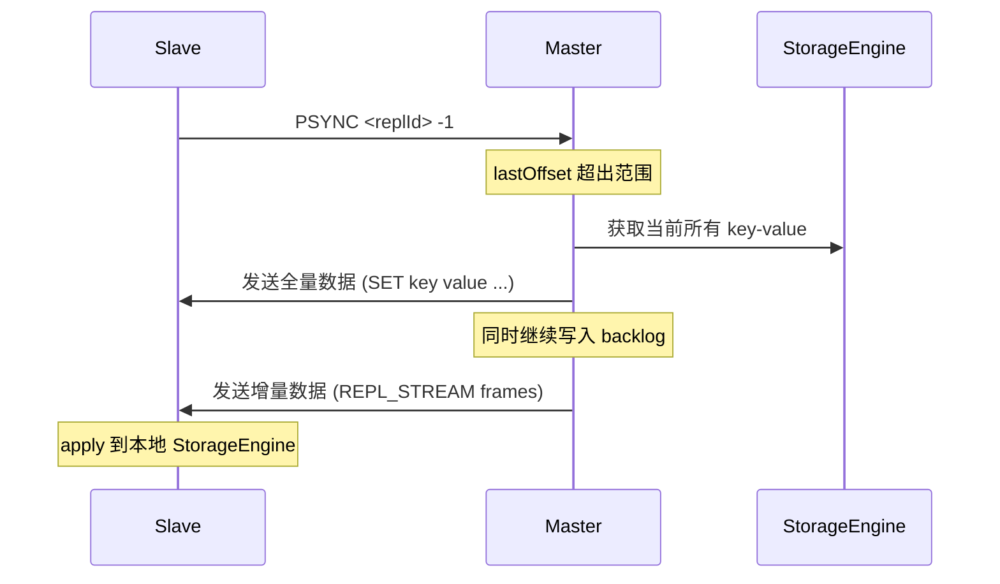
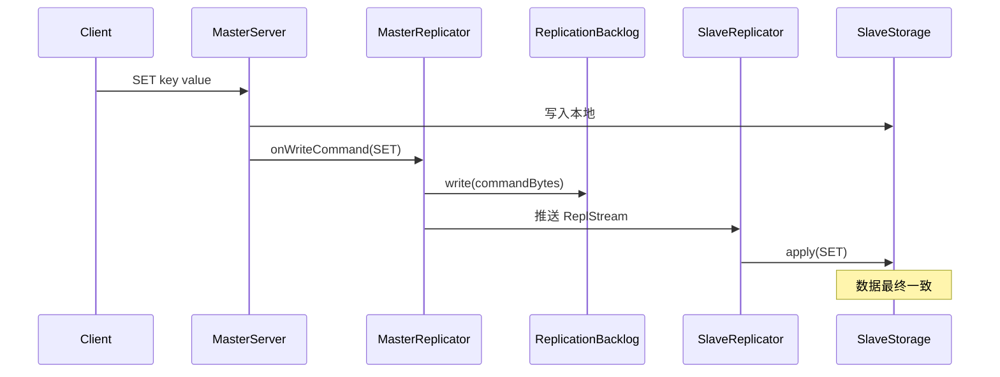

# 06 - 主从复制模块导览

## TL;DR

`netcache-cluster` 的 replication 子包实现了**异步主从复制**——master 写入的数据通过 `ReplicationBacklog`（环形缓冲区）和 `ReplStream`（复制流帧）推送给 slave。slave 可以断点续传（PSYNC 协议），在断开重连后从上次 offset 继续同步，而不需要全量复制。

---

## 它解决什么问题

数据存在一台机器上，万一硬盘坏了就丢了。解决办法是复制到多台机器——一份是「主」，其他是「从」。主从复制保证了数据安全和可用性。

**场景化**：想象电视台的「录像带备份」——主电视台把节目录到录像带，给从电视台寄过去。从电视台可以快进快退（断点续传），不需要每集都从头看。

---

## 核心概念（6个）

### ReplicationBacklog —— 复制环形缓冲区

**概念**：master 端维护的固定大小环形缓冲区，存储最近的写命令。

**💡 类比**：就像录像带的循环录像模式——录满 16MB 后自动从头覆盖，但会记录「当前指针位置」。

**关键参数：**
- 默认容量：16MB
- `write(byte[] cmd)`：追加命令
- `readFrom(long offset)`：从指定 offset 读取，支持断点续传

**裁剪规则**：如果 slave 的 offset 已经超出范围（被覆盖了），master 通知 slave 做全量同步。

```java
// 环形缓冲区的 offset 循环
ReplicationBacklog backlog = new ReplicationBacklog(16 * 1024 * 1024);
backlog.write(commandBytes);
ByteBuf data = backlog.readFrom(slaveOffset);
```

---

### MasterReplicator —— 主节点复制器

**概念**：master 端的管理器，把每条写命令写入 backlog 并推送给所有注册的 slave。

**协作关系：**
- 依赖 `ReplicationBacklog` 存储命令
- 依赖 `CopyOnWriteArrayList<Channel>` 维护 slave 连接列表
- 每条 SET/DEL 命令触发 `onWriteCommand()`

**关键方法：**

| 方法 | 作用 |
|---|---|
| `onWriteCommand(Command c)` | 把命令编码并写入 backlog，同时推送给所有 slave |
| `registerSlave(Channel ch)` | 注册一个新的 slave 连接 |
| `removeSlave(Channel ch)` | 移除断开的 slave |

---

### SlaveReplicator —— 从节点复制器

**概念**：slave 端的管理器，连接 master 并 apply 收到的复制流。

**💡 类比**：从电视台的录像机——接收主电视台发来的录像带，按顺序播放（apply 到本地存储）。

**关键方法：**

| 方法 | 作用 |
|---|---|
| `connect(host, port)` | 建立到 master 的 TCP 连接 |
| `applyStream()` | 读取并执行 ReplStream 中的命令 |
| `reportOffset()` | 上报当前已同步的 offset 给 master |

**断点续传**：
```
1. 连接 master，发送 PSYNC <replId> <lastOffset>
2. 如果 lastOffset 在 backlog 范围内 → 增量同步
3. 如果超出范围 → master 触发全量同步
```

---

### ReplStream —— 复制流帧格式

**概念**：Type=0x03 的特殊帧，用于 master → slave 的单向数据流。

**复制流 Payload 布局：**

```
+--------+----------+----------+
| Offset | OpCode   | KeyLen+K | ValLen+V |
|  8B    | 1B       |   4B+NB |   4B+NB  |
+--------+----------+----------+
```

- **Offset (8B)**：这个命令在 backlog 中的位置，slave 持久化最新 offset
- **OpCode (1B)**：写命令类型（SET、DEL 等）
- **KeyLen + Key**：键的长度和内容
- **ValLen + Val**：值的长度和内容（DEL 命令没有 value）

**为什么要有 Offset 前缀？**
slave 需要知道「我已经同步到哪了」，断线重连时告诉 master 从哪里继续。如果 master 的 backlog 已经覆盖了那段数据，slave 就得全量同步。

---

### PSYNC 协议 —— 复制握手

**概念**：slave 连接 master 时的同步协商协议。

**两种同步模式：**

| 模式 | 条件 | 流程 |
|---|---|---|
| **增量同步** | `lastOffset` 在 backlog 范围内 | master 从 `lastOffset` 开始推流 |
| **全量同步** | `lastOffset` 超出范围或 `replId` 不匹配 | master 发送内存快照 + 后续增量 |

**命令格式：**
```
PSYNC <replId> <lastOffset>
```

- `replId`：master 的 Replication ID（用于标识 master）
- `lastOffset`：slave 上次同步到的位置

---

### 全量同步流程

当增量同步不可用时触发：



全量同步期间 master 仍然可以处理写入，这些命令会进入 backlog。等 slave apply 完全量数据后，两者就一致了。

---

## 关键流程

### 正常复制流程（增量）



### 断线重连流程

```mermaid
sequenceDiagram
    participant SlaveReplicator
    participant MasterReplicator
    participant ReplicationBacklog

    SlaveReplicator->>MasterReplicator: PSYNC <replId> 12345
    MasterReplicator->>ReplicationBacklog: readFrom(12345)

    alt offset 在范围内
        ReplicationBacklog-->>MasterReplicator: 增量数据
        MasterReplicator-->>SlaveReplicator: 推送 ReplStream
    else offset 超出范围
        ReplicationBacklog-->>MasterReplicator: 全量快照请求
        Note: 触发全量同步
    end
```

---

## 代码导读

### 1. ReplicationBacklog.java —— 环形缓冲区

**文件**：`netcache-cluster/src/main/java/com/netcache/cluster/replication/ReplicationBacklog.java`

**关键点**：
- 使用 `Deque<ByteBuf>` 存储
- `write()` 追加，`readFrom()` 从指定位置读取
- 超过容量时裁剪旧数据

### 2. MasterReplicator.java —— 主节点推流

**文件**：`netcache-cluster/src/main/java/com/netcache/cluster/replication/MasterReplicator.java`

**关键点**：
- `CopyOnWriteArrayList<Channel>` 存储 slave 连接
- `onWriteCommand()` 同时写 backlog 和推流

### 3. SlaveReplicator.java —— 从节点收流

**文件**：`netcache-cluster/src/main/java/com/netcache/cluster/replication/SlaveReplicator.java`

**关键点**：
- `applyStream()` 循环读取并 apply
- `reportOffset()` 定期上报同步位置

### 4. ReplStream.java —— 复制流编码

**文件**：`netcache-cluster/src/main/java/com/netcache/cluster/replication/ReplStream.java`

**关键点**：
- `record` 不可变
- 包含 `offset`、`opCode`、`key`、`value`

---

## 常见坑

### 1. Backlog 太小导致频繁全量同步

如果 slave 断开太久（比如几分钟），而这段时间写入很多，16MB 的 backlog 可能就覆盖了之前的命令。这时 slave 必须全量同步，性能影响很大。

**调优建议**：根据「 slave 断开时的写入速率 × 最大断开时间」估算 backlog 大小。

### 2. 全量同步阻塞 master

全量同步时 master 需要遍历整个 `StorageEngine` 并序列化所有数据，这个过程可能很慢且占用内存。当前实现把快照发送放到独立线程，避免阻塞 EventLoop。

### 3. Slave apply 流时序不对导致数据错乱

slave 收到流后必须按顺序 apply，不能并行。这是因为 SET/DEL 之间可能有依赖（比如先 SET 再 INCR）。`SlaveReplicator.applyStream()` 是单线程顺序处理的。

### 4. Offset 持久化的时机

slave 应该在「成功 apply 之后」才更新 offset，而不是「收到之后」。否则如果 apply 失败重启，会重复 apply 同一批命令，导致数据错误。

### 5. PSYNC 协议没有认证

当前实现中只要知道 master 的地址和端口，任何机器都可以连接并尝试 PSYNC。在生产环境中需要加上认证机制。

---

## 动手练习

### 练习 1：模拟断线重连

1. 启动一个 master、一个 slave
2. 写入 1000 个 key
3. 断开 slave 的网络
4. 再写入 1000 个 key
5. 恢复连接，观察 slave 是增量同步还是全量同步
6. 如果是全量同步，增加 backlog 大小后再试

### 练习 2：观察复制延迟

1. 写入一个 key
2. 用 `System.currentTimeMillis()` 测量从「master 返回响应」到「slave 可查询到同一 key」的时间
3. 观察延迟与写入速率的关系

### 练习 3：测试全量同步触发

1. 写入大量数据，直到 backlog 报告「offset out of range」
2. 观察 master 的日志，确认触发了全量同步
3. 在全量同步期间持续写入，验证 slave 最终一致

---

## 下一步

- 理解了主从复制，下一步看 [07-哨兵模块](./07-module-sentinel.md)，了解故障转移如何协调。
