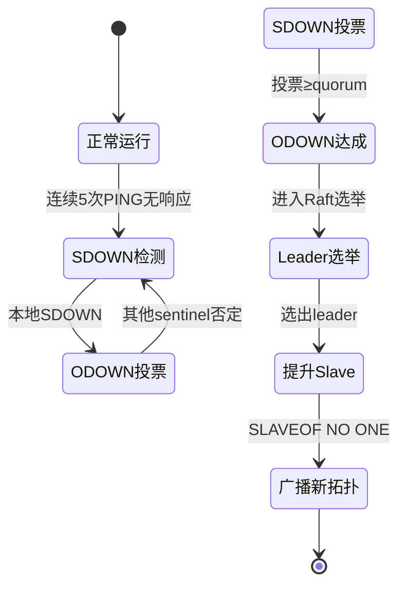
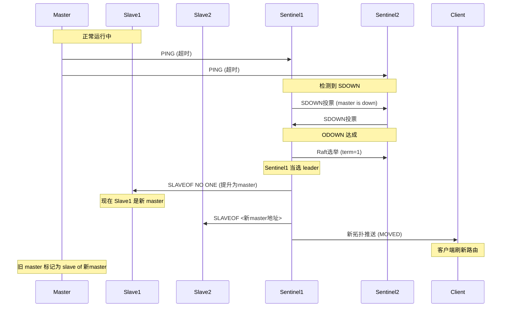

# 07 - 哨兵模块导览

## TL;DR

`netcache-sentinel` 模块实现了**故障转移**的核心逻辑——当 master 宕机时，哨兵们通过「主观下线检测」→ 「客观下线确认」→ 「Raft 风格 leader 选举」→ 「slave 提升」的流程，自动把一个 slave 提拔为新的 master。整个过程对客户端透明，故障恢复时间目标 < 3 秒。

---

## 它解决什么问题

分布式缓存不可能永远不宕机。当 master 挂了，如果没有人管，数据就写不进去了（除非你有其他 master 节点）。哨兵就是「值班医生」——监控所有节点的状态，发现问题自动「抢救」，把 slave 提拔成新 master。

**场景化**：想象医院的「值班医生」制度——主治医生（master）病了，其他医生（slave）要自动顶上来。主任（sentinel）负责判断「是真病了还是在睡觉」，确认后主持「投票选举」，选出最优的医生顶班。

---

## 核心概念（7个）

### SDOWN —— 主观下线

**概念**：单个哨兵认为某个节点已经挂了（连续 5 次 PING 无响应）。

**💡 类比**：值班护士看到某个医生不动了，觉得「他可能在睡觉」（主观判断）。

**判断条件**：
```java
now - lastHealthyAt > sdownAfterMs  // 默认 5000ms
```

**为什么是「主观」？**
因为可能只是网络闪断，这个哨兵和那个节点之间不通，但其他哨兵可能还能连通它。所以这只是「嫌疑」，不是最终结论。

---

### ODOWN —— 客观下线

**概念**：多个哨兵都认为某个节点挂了（SDOWN 投票 ≥ quorum），达成共识。

**💡 类比**：多个护士都报告「这个医生叫不醒」，主任确认「真病了」。

**判断条件**：
```java
sdownVotes.size() >= quorum  // quorum 默认 2
```

**为什么需要多个哨兵确认？**
避免网络分区导致的误判。如果只有一台哨兵，它自己误判就会触发不必要的 failover。多台哨兵互相确认，降低误判率。

---

### RaftLite —— 简化 leader 选举

**概念**：用于哨兵 leader 选举的简化 Raft 实现（只选举 leader，不做日志复制）。

**💡 类比**：医院里「谁主持抢救」——需要一个人统一指挥，不能两个人同时指挥。

**关键机制：**
- **term（任期）**：单调递增的版本号，防止旧任期的消息干扰
- **voteFor**：当前 term 投给谁
- **leader 选举规则**：term 最高的 node 优先，然后按 ID 字典序

**为什么不用完整 Raft？**
哨兵只需要选出一个 leader 来协调 failover，不需要在多个节点间复制日志。简化版足够，且更容易理解和实现。

---

### QuorumDecision —— 投票收集器

**概念**：收集和统计各个哨兵对某个节点的 SDOWN 投票。

**关键方法**：
```java
boolean reachesObjectiveDown(NodeId nodeId, int quorum)
// 返回 true 当且仅当 SDOWN 投票数 >= quorum
```

**协作关系：**
- `SentinelNode` 收集本地 SDOWN 事件后，通知 `QuorumDecision`
- `QuorumDecision` 汇总来自其他哨兵的 SDOWN 投票
- 当达到 quorum 时，触发 ODOWN

---

### HealthChecker —— 健康检查器

**概念**：定期向节点发送 PING，维护 `lastHealthyAt` 时间戳。

**关键行为：**
- 每 1 秒向所有监控的 master/slave 发送 PING
- 收到 PONG 更新 `lastHealthyAt`
- 如果 `now - lastHealthyAt > sdownAfterMs` → 标记为 SDOWN

**为什么用 PING/PONG？**
简单且开销低。只需要节点能响应网络请求即可，不需要复杂的应用层健康检查。

---

### FailoverCoordinator —— 故障转移协调器

**概念**：执行具体的 failover 步骤——选 slave、提升为 master、更新其他 slave 的配置、广播新拓扑。

**Failover 步骤：**

| 步骤 | 操作 |
|---|---|
| 1 | 确认 ODOWN达成 |
| 2 | Raft 选举出 leader sentinel |
| 3 | leader 挑选最优 slave（offset 最高 → 优先级最高 → ID 字典序） |
| 4 | 给最优 slave 发 `SLAVEOF NO ONE` 提升为 master |
| 5 | 给其他 slave 发 `SLAVEOF <newMaster>` |
| 6 | 广播新拓扑给所有哨兵和已知客户端 |
| 7 | `epoch += 1` |

**为什么用「offset 最高」选 slave？**
offset 最高意味着这个 slave 的数据和 master 最接近，提升后丢失的数据最少。

---

### SentinelNode —— 哨兵节点主类

**概念**：整合健康检查、投票收集、failover 协调的哨兵核心类。

**协作关系：**
- `HealthChecker` → SDOWN 事件
- `QuorumDecision` → ODOWN 投票汇总
- `FailoverCoordinator` → 执行 failover
- `RaftLite` → leader 选举

**启动流程：**
```
SentinelMain.main()
  → 读取 netcache.sentinel.id
  → 读取 netcache.sentinel.quorum
  → 实例化 SentinelNode
  → 启动 HealthChecker
  → 等待 failover 触发
```

---

## 关键流程

### 故障转移三幕剧



### 完整时序图



### 各阶段时间线

| 时间 | 事件 |
|---|---|
| T+0s | master 宕机 |
| T+5s | 所有 sentinel 检测到 SDOWN |
| T+5~10s | 投票达成 ODOWN，Raft 选举 leader |
| T+10~12s | leader 选择最优 slave，发出提升命令 |
| T+12~13s | 其他 slave 收到重配置命令 |
| T+13s | 广播新拓扑，客户端刷新路由 |
| **总耗时** | **< 3s** |

---

## 代码导读

### 1. HealthChecker.java —— 健康检查

**文件**：`netcache-cluster/src/main/java/com/netcache/cluster/sentinel/HealthChecker.java`

**关键点**：
- 行 35：`sdownAfterMs = 5000`（5 秒无响应判定 SDOWN）
- `ConcurrentHashMap<NodeId, Long> lastHealthyAt` 记录每个节点的健康时间

### 2. QuorumDecision.java —— 投票汇总

**文件**：`netcache-cluster/src/main/java/com/netcache/cluster/sentinel/QuorumDecision.java`

**关键点**：
- `reachesObjectiveDown()` 检查投票数是否达到 quorum
- `Map<NodeId, Set<SentinelId>> sdownReports` 记录每个节点的 SDOWN 投票

### 3. RaftLite.java —— leader 选举

**文件**：`netcache-cluster/src/main/java/com/netcache/cluster/sentinel/RaftLite.java`

**关键点**：
- `AtomicLong currentTerm` 维护当前任期
- `voteFor` 存储投票目标
- leader 选取规则：term 优先，然后 ID 字典序

### 4. FailoverCoordinator.java —— failover 执行

**文件**：`netcache-cluster/src/main/java/com/netcache/cluster/sentinel/FailoverCoordinator.java`

**关键点**：
- 行 50~60：`selectBestCandidate()` 选 offset 最高、priority 最高、ID 最小的 slave
- 行 70~85：按顺序执行提升和重配置

### 5. SentinelNode.java —— 哨兵主类

**文件**：`netcache-cluster/src/main/java/com/netcache/cluster/sentinel/SentinelNode.java`

**关键点**：
- `tryFailover()` 是入口，调用各个组件
- 协调所有哨兵组件

---

## 常见坑

### 1. Quorum 设置不当导致脑裂

如果 quorum = 1，任何一个哨兵都能触发 failover。如果 3 个哨兵部署在 3 台机器上，其中一台机器的网络和其他两台不通，那台机器会独自触发 failover，和其他两台产生冲突（脑裂）。

**正确设置**：quorum > 节点数 / 2。建议用 3 台哨兵 + quorum = 2 的组合。

### 2. Slave 提升后旧 master 恢复导致双主

旧 master 恢复后，如果它不知道自己是 slave 了，可能会继续接受写入，导致「双主」问题。

**当前实现**：failover 后旧 master 会被重配置为新 master 的 slave。但网络分区场景下如果旧 master 和新 master 同时存在，需要额外的 fencing 机制。

### 3. Sentinel 无法发现部分 slave

如果 sentinel 和 slave 之间的网络不通，sentinel 会错误地认为这个 slave 也挂了（SDOWN）。虽然不会直接触发 failover，但会影响 quorum 的计算。

### 4. Failover 期间客户端请求失败

在 failover 过程中（slave 提升为 master 之前），客户端的请求会失败或超时。这是因为客户端还在向旧 master 写数据，而旧 master 已经不提供服务了。

**优化方向**：客户端应该配置重试和快速刷新拓扑的机制。

### 5. 时间轮 tick 漂移导致 SDOWN 判定延迟

`HealthChecker` 每 1 秒 tick 一次，但实际间隔可能有轻微偏差。如果 `now - lastHealthyAt = 4999ms`（还不到 5 秒），下一次 tick 可能已经是 5.1 秒了。这种边界情况可能导致 SDOWN 判定比预期晚一点。

---

## 动手练习

### 练习 1：触发一次 SDOWN

1. 启动 master + 1 个 slave + 2 个 sentinel
2. 用 `docker stop` 停掉 master 容器
3. 观察两个 sentinel 的日志，看是否触发 SDOWN 检测
4. 记录从停掉到触发 SDOWN 的时间

### 练习 2：观察 ODOWN 达成

1. 继续上一步，只停掉 master 容器
2. 观察 sentinel 日志，看 quorum 如何计算
3. 如果只有一个 sentinel 检测到 SDOWN，是否会触发 ODOWN？

### 练习 3：完整的 Failover 演练

1. 启动 3 master + 3 slave + 3 sentinel 集群
2. 停掉 master-1
3. 观察 failover 完成时间（应该 < 3s）
4. 用客户端验证新 master 可写
5. 重启旧 master，验证它被配置为 slave

---

## 下一步

- 理解了故障转移，下一步看 [08-服务器模块](./08-module-server.md)，了解数据怎么在网络上传输。
