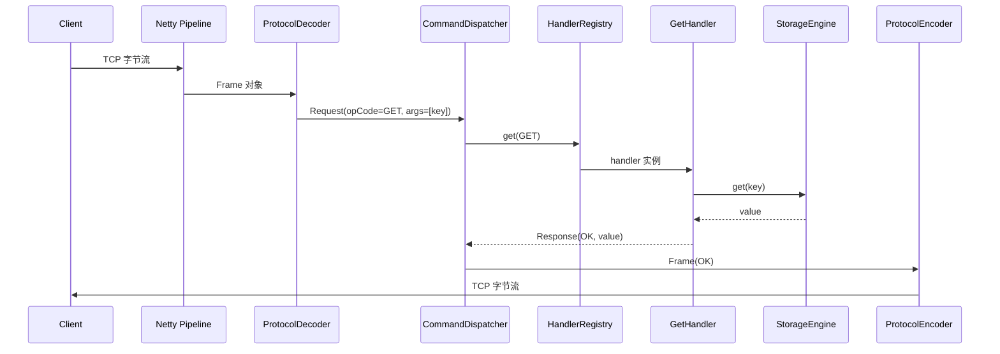
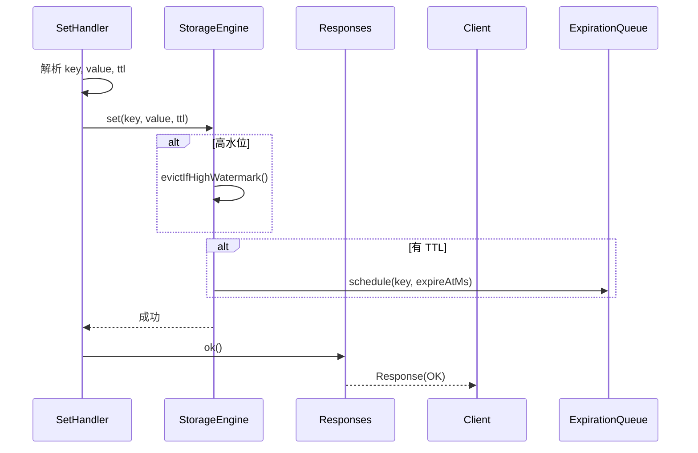

# 08 - netcache-server 模块导览

## TL;DR

`netcache-server` 是 NetCache 的「前台接待」——用 Netty 监听端口，把收到的字节流解码成请求，路由到对应的命令处理器，最后把处理结果编码成字节流返回。它是客户端真正对话的部分。

---

## 它解决什么问题

存储引擎再好，如果没有人能访问，数据就没用。服务器模块负责：把数据「存进去」、在需要时「取出来」。所有客户端的请求最终都到这里。

**场景化**：想象高级酒店的「前台」——客人（客户端）来了，前台（服务器）接待，问清楚需求后去找对应的部门（存储/集群），拿到结果后回复客人。前台必须快速、准确、不知疲倦。

---

## 核心概念（7个）

### NetCacheServer —— 服务器入口

**概念**：main 方法所在的启动类，初始化配置、启动 `NodeLifecycle`。

**💡 类比**：酒店前台经理——负责开业前的准备工作（装修、人员、流程），然后宣布「开门营业」。

**启动流程：**
```
main()
  → ServerConfig.fromSystemProperties()
  → NodeLifecycle.start()
  → Netty ServerBootstrap.bind()
```

---

### ServerBootstrapBuilder —— Netty 服务器构建器

**概念**：负责配置和构建 Netty `ServerBootstrap`。

**💡 类比**：酒店前台的「装修图纸」——规划好每一个岗位的位置和职责。

**Inbound Pipeline 布局：**

```
Socket.read()
  ↓
LengthFieldBasedFrameDecoder(maxFrame=16MB, lengthFieldOffset=14, lengthFieldLength=4)
  ↓
MagicValidator (校验 0xC0DECAFE)
  ↓
ProtocolDecoder (Frame → Request)
  ↓
CommandDispatcher (路由到 Handler)
  ↓
Handler (业务逻辑)
  ↓
ProtocolEncoder (Response → Frame)
  ↓
Socket.write()
```

**为什么这个顺序？**
1. `LengthFieldBasedFrameDecoder` 先处理粘包/半包问题——确保拿到完整帧
2. `MagicValidator` 过滤非法帧——不是以 `0xC0DECAFE` 开头就直接关连接
3. `ProtocolDecoder` 解码字节成 `Frame` 对象
4. `CommandDispatcher` 把帧分派到具体 handler

---

### CommandDispatcher —— 命令分派器

**概念**：`@Sharable` 的 Netty inbound handler，核心路由组件。

**💡 类比**：前台接线员——接到电话后转接到对应部门。

**关键流程：**
1. `channelRead0(ctx, msg)` 收到 `Frame` 对象
2. 解码 Frame payload 为 `Request`
3. 从 `HandlerRegistry` 找到对应 `OpCode` 的 `CommandHandler`
4. 执行 `handler.handle(request)`
5. 写入 `Response`

```java
// 行 68 附近
CommandHandler handler = HandlerRegistry.get(request.opCode());
Response response = handler.handle(request);
ctx.writeAndFlush(response);
```

---

### HandlerRegistry —— 处理器注册表

**概念**：静态工厂，根据 `OpCode` 创建和返回对应的 handler 实例。

**💡 类比**：酒店的「分机表」——每个部门有个分机号，前台根据需求转接到对应分机。

**已注册的 Handler：**

| OpCode | Handler | 功能 |
|---|---|---|
| GET (0x10) | GetHandler | 读取 |
| SET (0x11) | SetHandler | 写入 |
| DEL (0x12) | DelHandler | 删除 |
| EXISTS (0x15) | ExistsHandler | 存在检查 |
| EXPIRE (0x13) | ExpireHandler | 设置过期 |
| TTL (0x14) | TtlHandler | 查询剩余 TTL |
| INCR (0x16) | IncrHandler | 自增 |
| DECR (0x17) | DecrHandler | 自减 |
| PING (0x20) | PingHandler | 心跳 |
| INFO (0x21) | InfoHandler | 节点信息 |

---

### AbstractStorageHandler —— Handler 基类

**概念**：提供公共辅助方法的基类，所有存储相关的 handler 都继承它。

**💡 类比**：前台助理——帮前台快速查资料、验证证件。

**辅助方法：**

| 方法 | 作用 |
|---|---|
| `key(request)` | 从请求中提取 key 字节数组 |
| `arg(request, index)` | 从请求中提取指定位置的参数 |
| `requireArgCount(request, n)` | 验证参数个数，不足则抛异常 |
| `replyXXX()` | 回复各种类型的结果 |

---

### NodeLifecycle —— 节点生命周期管理

**概念**：管理服务器启动和关闭顺序的编排器。

**💡 类比**：酒店经理的工作日程——早上开门要做什么，晚上打烊要做什么。

**启动顺序：**
```
1. 初始化 StorageEngine
2. 初始化 ClusterTopology
3. 初始化 Replication（如果是 master）
4. 启动 Netty ServerBootstrap
5. 启动 ExpirationQueue（后台 TTL 扫描）
```

**关闭顺序：**
```
1. 停止接收新连接
2. 等待现有请求处理完成
3. 关闭 ExpirationQueue
4. 关闭 Netty EventLoopGroup
5. 关闭 StorageEngine
```

---

### MetricsCollector —— 指标收集器

**概念**：简单的请求计数器。

**💡 类比**：前台的「计数器」——记录今天接待了多少客人。

**指标：**
- `requestCount()`：累计请求数
- `recordRequest()`：每处理一个请求调用一次

---

## 关键流程

### 命令处理完整流程



### Handler 处理流程（以 SetHandler 为例）



---

## 代码导读

### 1. ServerBootstrapBuilder.java —— Netty 配置

**文件**：`netcache-server/src/main/java/com/netcache/server/netty/ServerBootstrapBuilder.java`

**关键点**：
- 行 30：`LengthFieldBasedFrameDecoder` 参数配置
- Pipeline 组装顺序

### 2. CommandDispatcher.java —— 请求路由

**文件**：`netcache-server/src/main/java/com/netcache/server/netty/CommandDispatcher.java`

**关键点**：
- 行 40：`channelRead0` 收到 Frame
- 行 53：HandlerRegistry 分派
- 行 60：异常处理

### 3. HandlerRegistry.java —— Handler 工厂

**文件**：`netcache-server/src/main/java/com/netcache/server/handler/HandlerRegistry.java`

**关键点**：
- `singleNode(StorageEngine)` 创建所有 handler 实例
- `Map<OpCode, CommandHandler> handlers` 映射表

### 4. AbstractStorageHandler.java —— Handler 基类

**文件**：`netcache-server/src/main/java/com/netcache/server/handler/AbstractStorageHandler.java`

**关键点**：
- `key()`、`arg()`、`requireArgCount()` 辅助方法
- 异常响应工厂方法

### 5. GetHandler.java —— 命令处理器示例

**文件**：`netcache-server/src/main/java/com/netcache/server/handler/GetHandler.java`

**关键点**：
- 行 20：`StorageEngine.get(key)` 获取值
- 行 26：`isNull()` 返回 NIL 响应
- 行 30：`stringResult()` 返回 STRING 响应

---

## 常见坑

### 1. Pipeline 组装顺序很重要

`LengthFieldBasedFrameDecoder` 必须在最前面，否则无法处理粘包/半包。如果把它放到 `MagicValidator` 后面，`MagicValidator` 可能收到不完整的帧导致误判。

### 2. Handler 必须线程安全

因为 Netty 的同一个 Channel 可能会被不同的 EventLoop 处理，但同一个 Pipeline 上的多个 handler 可能在同一个 EventLoop 上。如果是 `@Sharable` 的 handler，必须保证线程安全。

`CommandDispatcher` 是 `@Sharable` 的，因为它是无状态的——它只是路由，不持有任何可变状态。

### 3. ByteBuf 引用计数必须正确

当 `ProtocolDecoder` 用 `readRetainedSlice` 切出 payload 后，这个 payload 的引用计数 +1。当 `CommandDispatcher` 处理完 Frame 后，必须释放输入的 ByteBuf（通常在 finally 块或用 `ReferenceCountUtil.release`）。

如果不释放，Netty 的池化内存会泄漏。

### 4. 异常响应不能抛到 EventLoop 上

如果在 handler 里抛出了未捕获的异常，这个异常会传播到 Netty 的 pipeline，最终可能导致 EventLoop 线程中断。应该捕获异常并发送错误响应。

### 5. 响应和请求必须匹配 RequestId

客户端通过 RequestId 匹配请求和响应。如果 handler 返回的 Response 不包含正确的 RequestId，客户端会匹配错。

---

## 动手练习

### 练习 1：追踪一次 GET 请求

1. 在 `CommandDispatcher.channelRead0()` 加日志
2. 客户端发送 `GET key`
3. 观察 frame 的 magic、version、type、reqId、length

### 练习 2：测试半包处理

用 `ByteBuf` 构造一个不完整的帧（只有 18 字节头但 payload 长度 > 0），观察 `ProtocolDecoder` 如何处理。

### 练习 3：添加一个新命令

1. 在 `OpCode` 添加新命令码（比如 `APPEND = 0x18`）
2. 在 `HandlerRegistry` 注册 `AppendHandler`
3. 实现 `AppendHandler`（追加 value 到现有值后面）
4. 测试 `APPEND key additional_data`

---

## 下一步

- 理解了服务器如何处理请求，下一步看 [09-客户端模块](./09-module-client.md)，了解客户端怎么把请求发出去。
