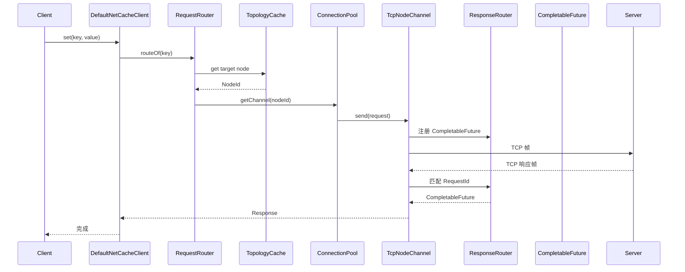
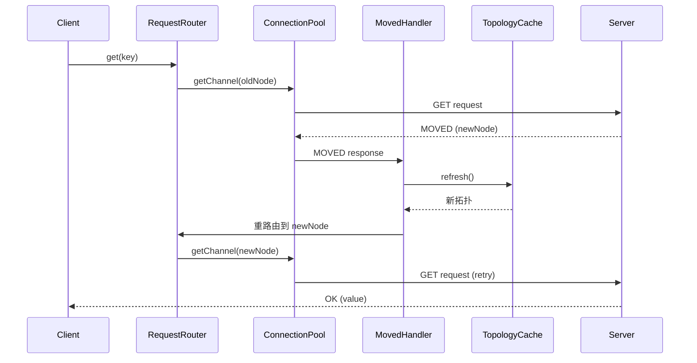

# 09 - netcache-client 模块导览

## TL;DR

`netcache-client` 是 NetCache 的「客户端 SDK」——让 Java 程序能方便地连接集群、发送请求、处理响应。它封装了连接池管理（`ConnectionPool`）、一致性哈希路由（`TopologyCache` + `RequestRouter`）、请求-响应匹配（`ResponseRouter`）和失败重试（`RetryPolicy`），对用户提供简洁的同步/异步 API。

---

## 它解决什么问题

客户端直接手写请求协议很麻烦——要自己处理连接池、路由、重试、响应匹配。客户端 SDK 把这些都封装好，让用户像调用本地方法一样调用分布式缓存。

**场景化**：想象去快递柜寄件——你不需要知道快递公司内部怎么分拣、怎么路由，你只需要「把包裹放进去、拿到取件码」。客户端 SDK 就是这个「自助寄件机」。

---

## 核心概念（7个）

### NetCacheClient —— 客户端接口

**概念**：公开 API 接口，定义同步和异步的 KV 操作。

**💡 类比**：快递柜的操作面板——「存件」「取件」两个按钮。

**公开方法：**

| 方法 | 返回值 | 说明 |
|---|---|---|
| `get(key)` | `byte[]` | 同步读取 |
| `set(key, value)` | `void` | 同步写入 |
| `set(key, value, ttl)` | `void` | 带 TTL 写入 |
| `del(key)` | `boolean` | 删除 |
| `incr(key)` | `long` | 原子自增 |
| `expire(key, ttl)` | `boolean` | 设置过期 |
| `getAsync(key)` | `CompletableFuture<byte[]>` | 异步读取 |

**使用示例：**
```java
try (NetCacheClient client = NetCacheClient.builder()
        .seeds("10.0.0.1:7001", "10.0.0.2:7001")
        .poolSizePerNode(8)
        .build()) {
    client.set("hello".getBytes(), "world".getBytes());
    byte[] value = client.get("hello".getBytes());
}
```

---

### DefaultNetCacheClient —— 核心实现

**概念**：`NetCacheClient` 的实现类，协调所有内部组件。

**💡 类比**：快递柜的内部控制系统——协调电机、传感器、锁。

**协作关系：**
- `RequestRouter` 路由请求
- `RetryPolicy` 处理重试
- `ConnectionPool` 发送请求
- `ResponseRouter` 匹配响应

**线程安全**：是的，所有公共方法都是线程安全的，内部使用原子操作。

---

### ClientBuilder —— 流式构建器

**概念**：用于构建 `NetCacheClient` 实例的配置 builder。

**💡 类比**：快递柜的「设置向导」——选择柜子数量、超时时间等。

**可配置项：**

| 参数 | 默认值 | 说明 |
|---|---|---|
| `seeds` | - | 集群种子节点地址（必填） |
| `poolSizePerNode` | `8` | 每个节点的长连接数 |
| `connectTimeout` | `500ms` | 连接超时 |
| `readTimeout` | `2s` | 读取超时 |
| `maxRetries` | `3` | 最大重试次数 |

**使用示例：**
```java
NetCacheClient client = NetCacheClient.builder()
    .seeds("127.0.0.1:7001")
    .poolSizePerNode(8)
    .connectTimeout(Duration.ofMillis(500))
    .readTimeout(Duration.ofSeconds(2))
    .maxRetries(3)
    .build();
```

---

### ConnectionPool —— 连接池

**概念**：管理到每个节点的多条长连接，使用 Round-Robin 分发请求。

**💡 类比**：银行的「多个窗口」——减少排队，提高并发。

**关键设计：**
- 每节点 `poolSizePerNode` 条连接（默认 8）
- `AtomicInteger cursor` 实现 Round-Robin
- 连接是持久的，失败时通知 `ResponseRouter`

```java
// Round-Robin 选择
int index = cursor.incrementAndGet() % connections.size();
NodeChannel channel = connections.get(index);
```

---

### TopologyCache —— 拓扑缓存

**概念**：本地缓存的集群拓扑信息，包含哈希环和节点表。

**💡 类比**：快递柜的「地址簿」——记录每个格口柜子在哪。

**初始化**：启动时从 `seeds` 拉取 `CLUSTER_NODES` 命令填充。

**更新机制：**
- 被动：客户端定时刷新
- 主动：收到 `MOVED` 响应后立即刷新

---

### RequestRouter —— 请求路由器

**概念**：根据 key 决定请求发到哪个节点。

**💡 类比**：快递柜的「分拣机」——根据地址决定用哪个格口。

**路由逻辑：**
```java
NodeId target = topologyCache.routeOf(key);
NodeChannel channel = connectionPool.getChannel(target);
CompletableFuture<Response> future = channel.send(request);
```

**MOVED 处理**：
1. 收到 Status=0x02 (MOVED) 响应
2. `MovedHandler` 解析目标节点
3. 重路由到新节点
4. 异步刷新拓扑缓存

---

### RetryPolicy —— 重试策略

**概念**：指数退避 + 抖动（jitter），防止频繁重试。

**💡 类比**：双十一快递员送件——第一次没人在，再等久一点再去，避免「都在同一时间敲门」。

**退避公式**：
```java
backoff = min(50ms * 2^attempt, 2000ms)
jitter = random(-backoff/5, +backoff/5)  // ±20%
```

| attempt | base (ms) | jitter (ms) | total (ms) |
|---|---|---|---|
| 0 | 50 | ±10 | 40~60 |
| 1 | 100 | ±20 | 80~120 |
| 2 | 200 | ±40 | 160~240 |
| 3 | 400 | ±80 | 320~480 |
| 4 | 800 | ±160 | 640~960 |
| 5 | 1600 | ±320 | 1280~1920 |
| 6 | 2000 | ±400 | 1600~2400 |

---

## 关键流程

### SET 请求完整流程



### MOVED 重路由流程



---

## 代码导读

### 1. DefaultNetCacheClient.java —— 客户端核心

**文件**：`netcache-client/src/main/java/com/netcache/client/DefaultNetCacheClient.java`

**关键点**：
- `AtomicLong requestIdGenerator` 生成单调递增的 RequestId
- `RetryPolicy` 封装在 `executeWithRetry()` 方法中

### 2. ConnectionPool.java —— 连接池管理

**文件**：`netcache-client/src/main/java/com/netcache/client/pool/ConnectionPool.java`

**关键点**：
- 行 22：`poolSizePerNode = 8` 每节点连接数
- 行 24：`cursor` 轮询指针
- `getChannel(NodeId)` 选一条连接

### 3. ResponseRouter.java —— 响应匹配器

**文件**：`netcache-client/src/main/java/com/netcache/client/routing/ResponseRouter.java`

**关键点**：
- `ConcurrentHashMap<Long, CompletableFuture>` 存储 pending 请求
- `channelRead()` 收到响应后 complete 对应的 future

### 4. RetryPolicy.java —— 重试策略

**文件**：`netcache-client/src/main/java/com/netcache/client/retry/RetryPolicy.java`

**关键点**：
- 行 14：`base = 50L`
- 行 15：`factor = 2`
- 行 16：`cap = 2000L`
- `backoff()` 方法计算退避时间

### 5. TopologyCache.java —— 拓扑缓存

**文件**：`netcache-client/src/main/java/com/netcache/client/routing/TopologyCache.java`

**关键点**：
- `Map<NodeId, NodeEndpoint>` 节点表
- `HashRing` 哈希环
- `refresh()` 从种子节点拉取新拓扑

---

## 常见坑

### 1. 连接池大小不是越大越好

8 条连接/节点是经验值。如果太多，连接管理开销大；如果太少，并发受限。对于大多数场景，默认值就够了。

### 2. 重试可能导致重复操作

`RetryPolicy` 在网络超时时会重试，但如果服务器实际处理了请求只是响应没回来，会导致重复操作（比如重复 SET）。

**解决方案**：使用幂等操作（SET/DEL），避免非幂等操作（INCR/DECR）在重试时出问题。

### 3. MOVED 响应处理不及时

如果集群拓扑变化频繁（比如频繁 failover），客户端会频繁收到 MOVED 并刷新拓扑，这会影响性能。可以配置拓扑刷新间隔。

### 4. 同步 API 阻塞 EventLoop

如果用同步 API（`client.get()`），当前线程会阻塞等待 CompletableFuture 完成。Netty 底层是 NIO，但用户线程是 BIO。

**建议**：高并发场景用异步 API（`client.getAsync()`）。

### 5. 种子节点全挂了

如果所有种子节点都挂了，客户端无法获取集群拓扑。这时 `TopologyCache` 会退化到「简单哈希」模式：用 `Arrays.hashCode(key) % seeds.size()` 路由。

这不是真正的哈希环，但至少能让部分请求成功。

---

## 动手练习

### 练习 1：观察连接池行为

1. 设置 `poolSizePerNode = 2`
2. 并发发送 10 个请求
3. 观察是否每条连接收到了 5 个请求（Round-Robin）

### 练习 2：测试重试退避

1. 启动一个会拒绝连接的服务
2. 设置 `maxRetries = 3`
3. 发送请求，观察日志中的重试间隔

### 练习 3：触发 MOVED 重路由

1. 启动 3 节点集群
2. 写入一些 key
3. kill 掉其中一个节点，触发 failover
4. 观察客户端日志，看是否触发了 MOVED 重路由

---

## 下一步

- 理解了客户端如何发送请求，下一步看 [10-端到端追踪](./10-end-to-end-trace.md)，从宏观角度追踪一次 SET 请求的完整旅程。
