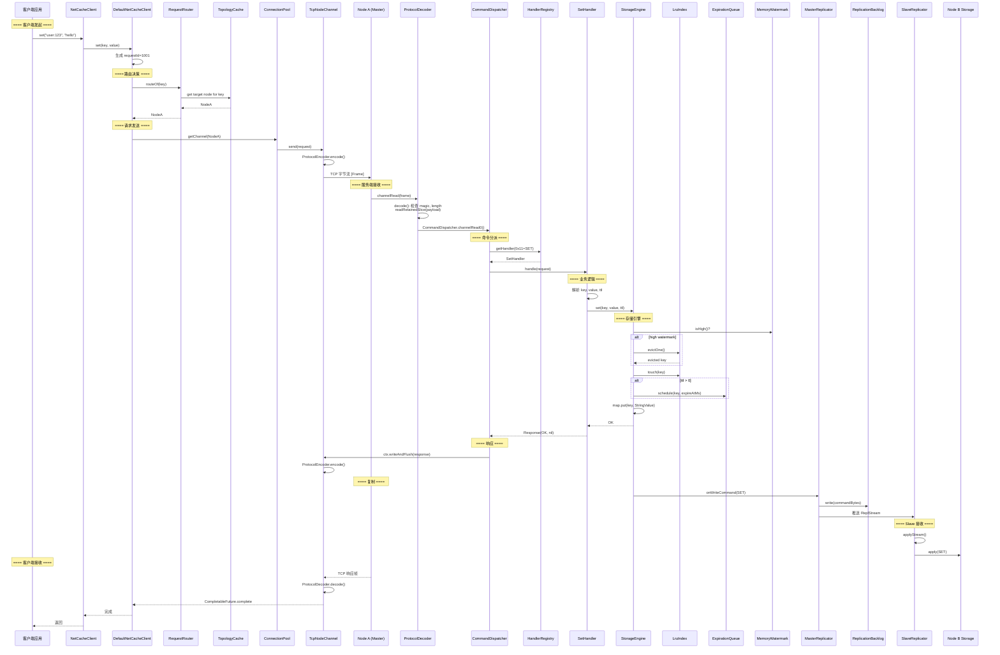

# 10 - 端到端追踪：一次 SET 请求的完整旅程

## TL;DR

一次 `SET user:123 "hello"` 请求从客户端创建到最终存储在 slave，经历：**客户端编码** → **网络传输** → **服务端解码** → **命令分派** → **存储写入** → **复制推送** → **从节点应用**。整条链路涉及 10+ 个关键类和 2 个 EventLoop。

---

## 请求背景

假设我们有：
- 3 个 NetCache 节点（Node A/B/C），哈希环上有 160 个虚拟节点/物理节点
- `user:123` 的哈希值落在 Node A 的负责区间
- Node A 是 master，Node B 是它的 slave

客户端要执行：
```java
client.set("user:123".getBytes(), "hello".getBytes());
```

---

## 完整时序图



---

## 链路详解

### 第一段：客户端发起

| 组件 | 关键操作 |
|---|---|
| `NetCacheClient` | 对外 API，try-with-resources 自动关闭 |
| `DefaultNetCacheClient` | 生成 requestId，协调 RetryPolicy |
| `RequestRouter` | 用 `TopologyCache.routeOf(key)` 查到 Node A |
| `ConnectionPool` | 用 Round-Robin 选一条到 Node A 的连接 |
| `TcpNodeChannel` | `ProtocolEncoder` 把 Request 编码成 ByteBuf 并发送 |

**RequestId 的作用**：
- 客户端用 `AtomicLong` 生成单调递增的 requestId
- 用于 `ResponseRouter` 匹配请求和响应
- 支持并发请求复用同一连接

---

### 第二段：网络传输

**TCP 层**：
- 连接是持久的长连接（不是短连接）
- 底层 Netty 用 NIO，但用户代码看到的是同步 API

**协议层**：

```
Frame 布局（18B header + N B payload）：
+-------+-----+----+-----------+--------+----------+
| Magic | Ver | T  | RequestId | Length | Payload  |
|  4B   | 1B  | 1B |    8B     |   4B   |   N B    |
+-------+-----+----+-----------+--------+----------+

SET 请求 Payload：
+--------+--------------+----------+----------+----+----------+
| OpCode | ArgCount(2B) | Arg1Len  | Arg1Body | ...| ArgNBody |
| 1B     | 2B           | 4B       | M B      |    |          |
+--------+--------------+----------+----------+----+----------+
```

---

### 第三段：服务端处理

**Pipeline**：
```
LengthFieldBasedFrameDecoder → MagicValidator → ProtocolDecoder → CommandDispatcher
```

**关键类**：

| 类 | 职责 |
|---|---|
| `ProtocolDecoder` | 检查 magic=0xC0DECAFE，用 `readRetainedSlice` 切出 payload |
| `CommandDispatcher` | 解码 Frame payload 为 Request，从 HandlerRegistry 找 handler |
| `SetHandler` | 解析参数，调用 StorageEngine |
| `StorageEngine` | 写 Map，检查内存水位，触发 LRU touch，安排 TTL |

**存储流程**：

```text
StorageEngine.set(key, value, ttl)
  ↓
MemoryWatermark.isHigh()?  // 检查是否需要淘汰
  ↓ (是)
EvictionPolicy.evictOne() → LruIndex.evictOne() → map.remove(evictedKey)
  ↓
LruIndex.touch(key)  // 记录最近访问
  ↓
ExpirationQueue.schedule(key, expireAtMs)  // 如果有 TTL
  ↓
map.put(key, StringValue)  // 写入数据
```

---

### 第四段：主从复制

**MasterReplicator** 收到 `onWriteCommand` 通知后：

1. 把命令编码成 `ReplStream` 帧
2. 写入 `ReplicationBacklog`（环形缓冲区）
3. 推送给所有注册的 slave 连接

```java
// MasterReplicator.onWriteCommand
backlog.write(commandBytes);  // 存入环形缓冲区
for (Channel slave : slaves) {
    slave.writeAndFlush(replStream);
}
```

**SlaveReplicator** 收到后：
1. 解析 `ReplStream` 帧
2. 提取 OpCode、key、value
3. apply 到本地 `StorageEngine`

---

### 第五段：客户端接收

**Response 帧**：
```
Status(1B) + ResultType(1B) + Body(N B)
```

- Status=0x00 (OK) 表示成功
- `ResponseRouter` 用 requestId 匹配到对应的 `CompletableFuture` 并 complete

---

## 数据结构变化

### 执行前（Node A StorageEngine）

```
map: {}
lruIndex: {}
expirationQueue: {}
```

### 执行后（Node A StorageEngine）

```
map: {
  ByteKey("user:123") -> StringValue("hello", expireAtMs=0, lastAccessMs=now)
}
lruIndex: {
  Segment[0..15]: linked list updated with "user:123" at head
}
expirationQueue: {
  // 如果没有 TTL，这里是空的
}
```

### Node B StorageEngine（最终一致）

```
map: {
  ByteKey("user:123") -> StringValue("hello", expireAtMs=0, lastAccessMs=...)
}
```

---

## 时间线（近似值）

| 阶段 | 耗时 |
|---|---|
| 客户端编码 + 发送 | ~0.1ms |
| 网络传输 | ~0.5~2ms（局域网） |
| 服务端解码 | ~0.01ms |
| StorageEngine.set | ~0.1ms |
| 响应编码 + 发送 | ~0.1ms |
| **总计** | **~1~3ms** |

p99 目标 ≤ 5ms。

---

## 下一步

- 理解了完整的请求流程，下一步看 [11-failover-walkthrough.md](./11-failover-walkthrough.md)，了解故障转移的完整过程。
