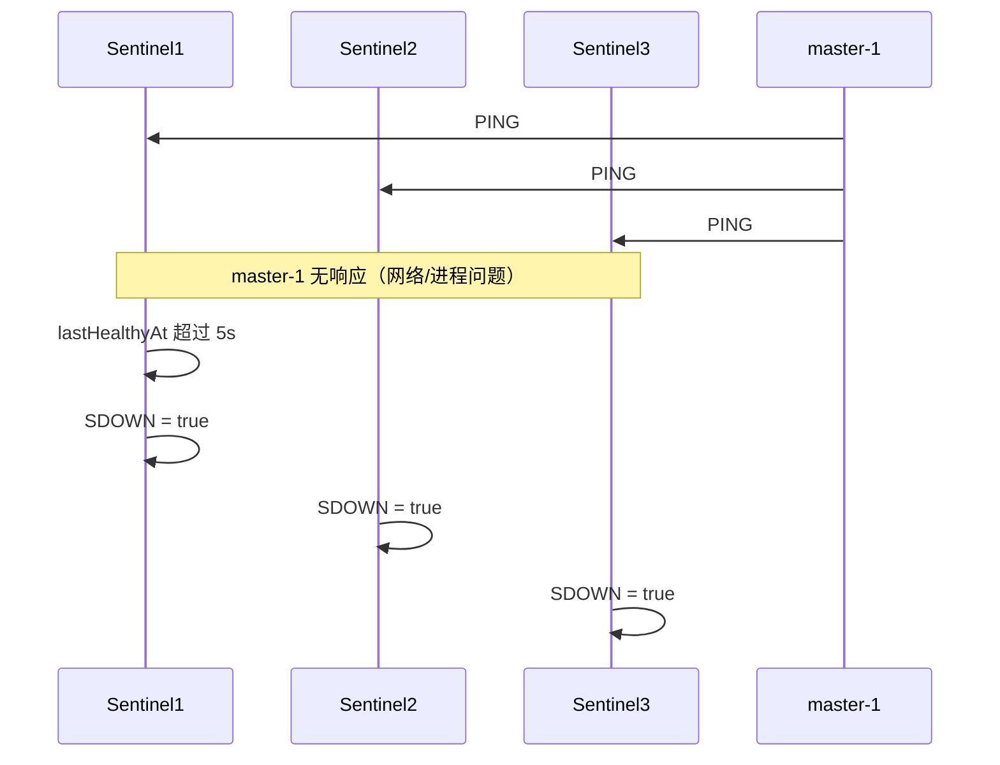
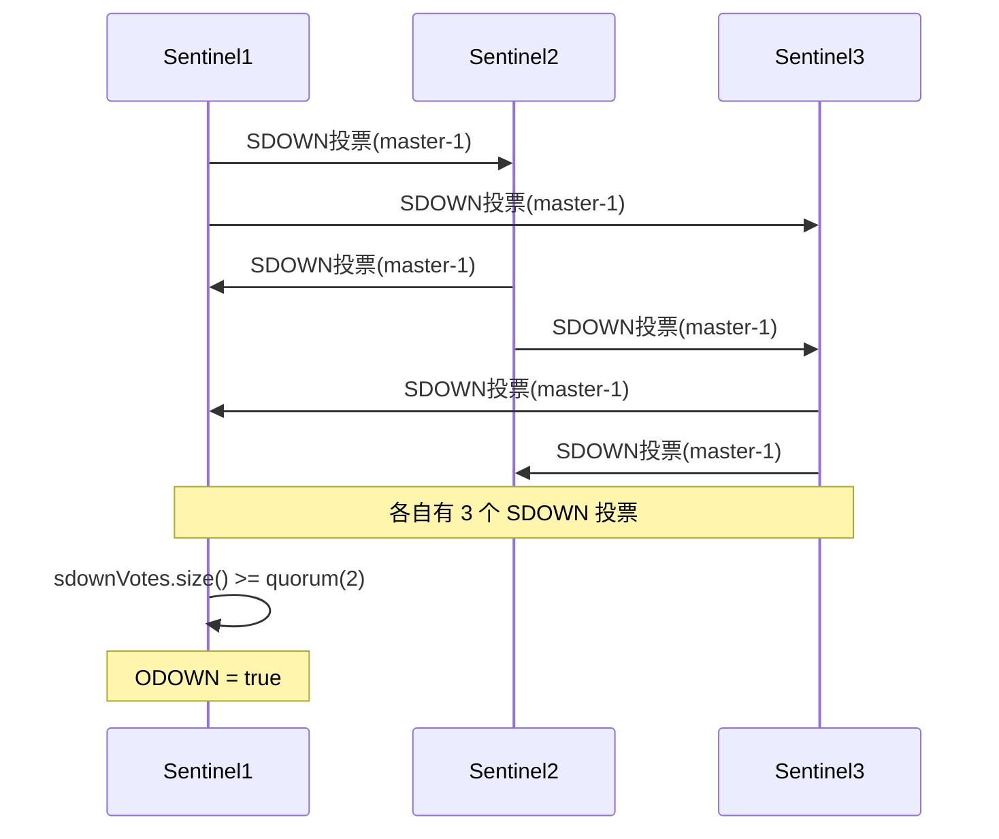
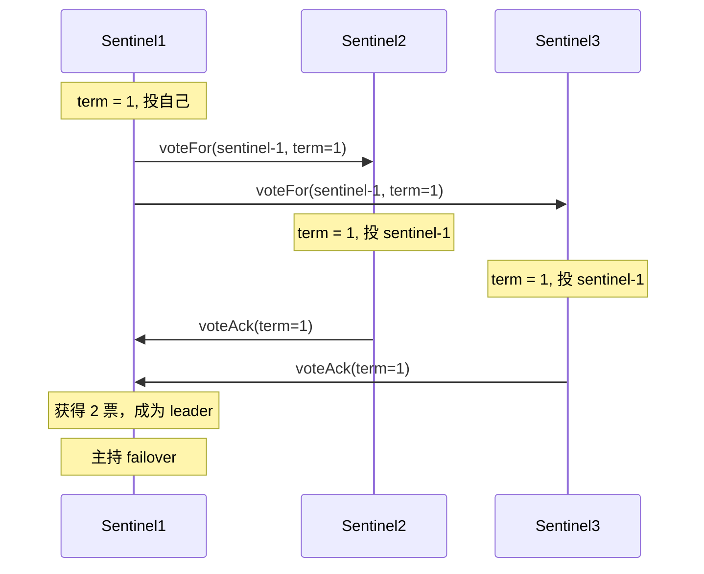
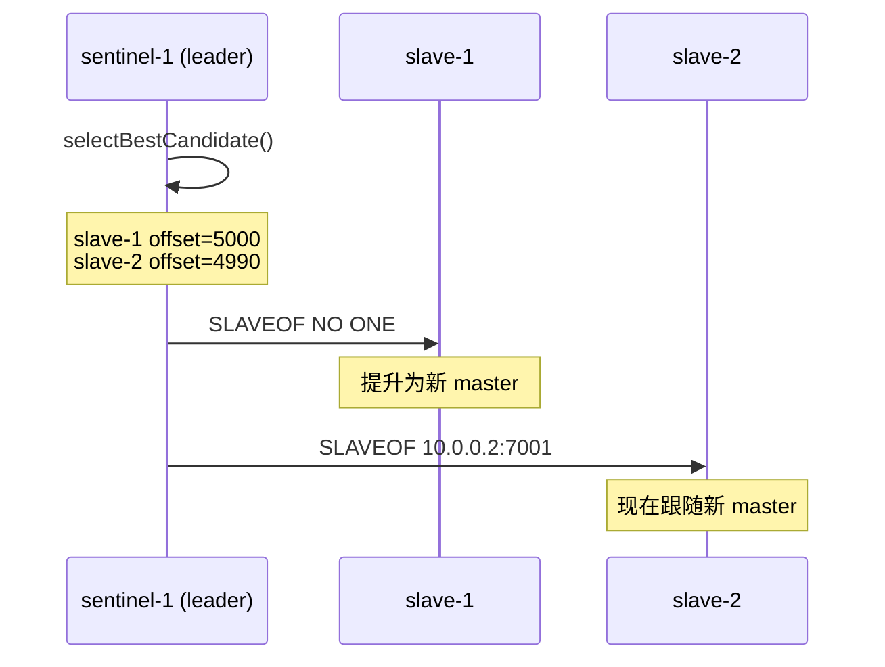
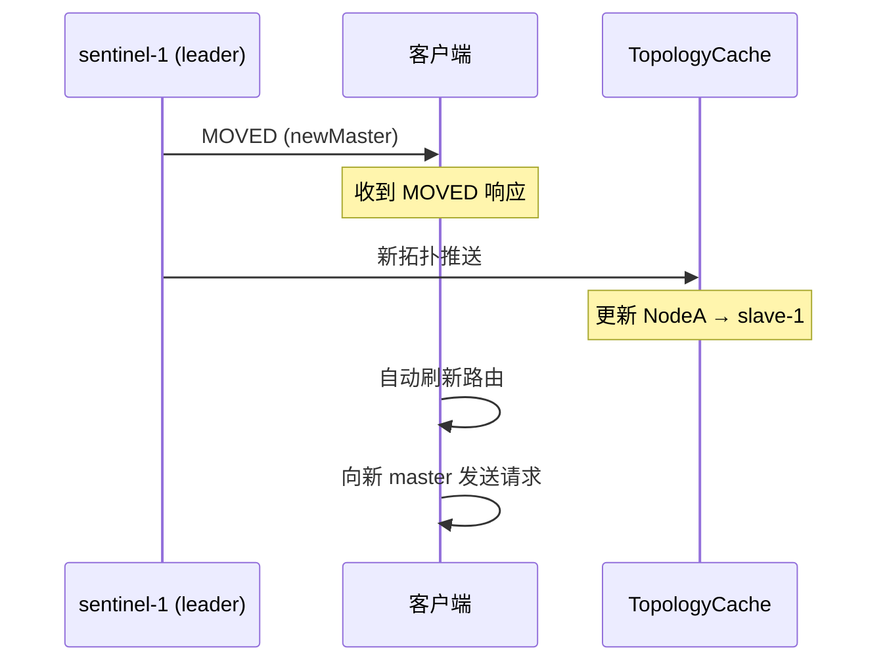

# 11 - 故障转移全流程详解

## TL;DR

当 master 宕机时，Sentinel 哨兵通过 SDOWN 检测 → ODOWN 投票 → Raft 选举 leader → 提升最优 slave → 广播新拓扑的流程，在 3 秒内完成故障转移。客户端感知到 `MOVED` 响应后自动刷新拓扑，继续写入新 master。

---

## 场景设定

**集群配置**：
- 3 个 NetCache 节点：master-1、slave-1、slave-2
- 3 个 Sentinel 哨兵：sentinel-1、sentinel-2、sentinel-3
- quorum = 2

**初始状态**：
```
master-1 (10.0.0.1:7001) ──replication──> slave-1 (10.0.0.2:7001)
master-1 (10.0.0.1:7001) ──replication──> slave-2 (10.0.0.3:7001)

sentinel-1 监控 master-1
sentinel-2 监控 master-1
sentinel-3 监控 master-1
```

---

## 故障转移时间线

```mermaid
gantt
    title Failover Timeline
    dateFormat X
    section 检测
    sentinel 检测到 SDOWN    :0, 5000
    section 投票
    ODOWN 达成              :5000, 8000
    section 选举
    Raft leader 选举         :8000, 10000
    section 提升
    slave 提升为 master     :10000, 12000
    section 广播
    新拓扑广播给客户端       :12000, 13000
    section 完成
    故障恢复完成             :0, 13000
```



| 时间点 | 事件 | 耗时 |
|---|---|---|
| T+0s | master-1 宕机 | - |
| T+5s | 3 个 sentinel 都检测到 SDOWN | 5s |
| T+8s | ODOWN 达成（2 票） | +3s |
| T+10s | Raft 选举完成，sentinel-1 当选 leader | +2s |
| T+12s | sentinel-1 提升 slave-1 为新 master | +2s |
| T+13s | 广播新拓扑，客户端刷新路由 | +1s |
| **总耗时** | | **< 3s** |

---

## 第一幕：SDOWN 检测

**触发条件**：
- sentinel 每 1s 向 master-1 发送 PING
- 连续 5s 无响应 → SDOWN（主观下线）



**关键代码（HealthChecker）**：
```java
if (now - lastHealthyAt > sdownAfterMs) {  // sdownAfterMs = 5000
    // 标记为 SDOWN
    sdownMap.put(nodeId, true);
}
```

---

## 第二幕：ODOWN 投票

**触发条件**：
- 某个 sentinel 发现 SDOWN 后，广播给其他 sentinel
- 收到 ≥ quorum（2）个 SDOWN 投票 → ODOWN 达成



**关键代码（QuorumDecision）**：
```java
boolean reachesObjectiveDown(NodeId nodeId, int quorum) {
    return sdownReports.get(nodeId).size() >= quorum;
}
```

---

## 第三幕：Raft 选举

**触发条件**：
- ODOWN 达成后，需要选出一个 sentinel 作为 failover 的 leader
- 用简化版 Raft（term + voteFor）选举



**leader 选举规则（RaftLite）**：
1. term 越高越优先
2. term 相同，ID 字典序越小越优先

**为什么需要 leader？**
避免多个 sentinel 同时主持 failover，导致拓扑冲突。必须有一个人统一指挥。

---

## 第四幕：提升 Slave

**leader sentinel（sentinel-1）选择最优 slave**：

| 优先级 | 条件 |
|---|---|
| 1 | replication offset 最高（数据最新） |
| 2 | priority 配置最高 |
| 3 | ID 字典序最小 |

**假设 slave-1 的 offset 更高**：



**SLAVEOF NO ONE** 是 Redis/NetCache 的命令，意思是「不再是从节点，成为独立节点」。

---

## 第五幕：广播新拓扑



**客户端收到 MOVED 后**：
1. `MovedHandler` 解析新节点地址
2. 重路由请求到新节点
3. 异步刷新 `TopologyCache`

---

## 新拓扑状态

**Failover 完成后**：

```
slave-1 (10.0.0.2:7001) ──replication──> slave-2 (10.0.0.3:7001) [新 master]
                                            ↑
                                    SLAVEOF 10.0.0.2:7001

master-1 (10.0.0.1:7001) ──replication──> slave-1 (10.0.0.2:7001) [降级为 slave]
                                            ↑
                                    SLAVEOF 10.0.0.2:7001
```

**epoch 递增**：拓扑版本号 +1，旧 epoch 的消息直接丢弃。

---

## 代码导读

### FailoverCoordinator.java —— failover 执行

**文件**：`netcache-cluster/src/main/java/com/netcache/cluster/sentinel/FailoverCoordinator.java`

**关键方法**：

```java
public void failover(NodeId masterId) {
    // 1. 验证 ODOWN 达成
    if (!quorumDecision.reachesObjectiveDown(masterId, quorum)) {
        return;
    }

    // 2. 选举 leader
    RaftLite.Leader leader = raftLite electLeader();

    // 3. 选择最优 slave
    NodeId bestSlave = selectBestCandidate(masterId);

    // 4. 提升 slave 为 master
    sendCommand(bestSlave, SLAVEOF NO ONE);

    // 5. 重配置其他 slave
    for (NodeId slave : getOtherSlaves(masterId)) {
        sendCommand(slave, SLAVEOF bestSlave);
    }

    // 6. 广播新拓扑
    clusterTopology.apply(newTopology);

    // 7. epoch++
    epoch.incrementAndGet();
}
```

### selectBestCandidate 逻辑

```java
NodeId selectBestCandidate(NodeId masterId) {
    List<NodeId> slaves = getSlavesOf(masterId);
    return slaves.stream()
        .max(Comparator.comparing(NodeId::getReplicationOffset)
            .thenComparing(NodeId::getPriority)
            .thenComparing(NodeId::getId))  // UUID 比较
        .orElseThrow(() -> new IllegalStateException("No slave available"));
}
```

---

## 常见坑

### 1. Quorum 设置错误导致脑裂

如果 quorum=1，任何一个 sentinel 都可以单独触发 failover。如果网络分区，三个 sentinel 各在一个「岛」上，都会触发自己的 failover，产生多个新 master。

**正确设置**：quorum > 节点数 / 2。3 个 sentinel → quorum=2。

### 2. 旧 master 恢复导致双主

如果旧 master 在 failover 后恢复，但还不知道自己已经不是 master 了，它可能会继续接受写入，产生「双主」问题。

**当前实现**：failover 后旧 master 会被重配置为新 master 的 slave。但网络分区场景需要额外的 fencing。

### 3. Slave 选择算法依赖 offset

如果所有 slave 的 offset 相同，会 fallback 到 priority 和 UUID 比较。UUID 比较是随机的，可能导致不一致的选择。

---

## 动手练习

### 练习 1：触发一次 failover

```bash
# 启动集群
docker compose up --build

# 找到 master-1 容器 ID
docker ps | grep netcache-master

# kill 掉 master-1
./scripts/kill-master.sh master-1

# 观察日志，看 failover 是否在 3s 内完成
docker logs -f sentinel-1
```

### 练习 2：验证客户端透明切换

1. 启动集群 + 客户端
2. 客户端持续发送 `INCR counter`
3. `kill-master.sh master-1`
4. 观察客户端是否自动恢复，counter 是否连续

### 练习 3：观察 Raft 选举

在 sentinel 日志中搜索 `term`、`voteFor`、`leader`，观察选举过程。

---

## 下一步

- 理解了故障转移，下一步看 [12-debug-and-tools.md](./12-debug-and-tools.md)，学习如何调试和排查问题。
